# Studfy — Sistem Mimarisi (ARCHITECTURE.md)

> **Statü:** Foundation v1.0 · **Sahip:** Platform & Architecture Guild · **Son güncelleme:** 2026-06-27
> **İlgili dokümanlar:** [`docs/PRD.md`](./PRD.md) · [`docs/adr/`](./adr/)

Bu doküman, Studfy'ın **AI-native öğrenme işletim sistemi** olarak çalışan dağıtık mimarisini, servis sınırlarını, veri akışlarını, deployment topolojisini ve ölçeklenebilirlik/dayanıklılık kararlarını tanımlar. Hedef kitle: senior backend/platform/ML mühendisleri ve teknik liderlerdir.

**Ürün özeti:** Kullanıcı herhangi bir şeyi yükler (PDF, taranmış doküman, el yazısı fotoğrafı, ses/video, YouTube linki) ve bu içerik; **aranabilir, açıklanabilir, test edilebilir ve dinlenebilir** bilgiye dönüşür. Ücretsiz, kullanıcı başına **şifreli ve izole** çalışma alanı. Temel ilke: **sıfır-halüsinasyon** — AI yalnızca kullanıcının kendi verisinden konuşur.

İçindekiler:

1. [Mimari Genel Bakış (C4)](#1-mimari-genel-bakış-c4)
2. [Servis Sınırları](#2-servis-sınırları-service-boundaries)
3. [Senkron vs Asenkron Akışlar](#3-senkron-vs-asenkron-akışlar)
4. [Veri Akışı](#4-veri-akışı)
5. [Deployment Topolojisi](#5-deployment-topolojisi)
6. [Ölçeklenebilirlik & Performans](#6-ölçeklenebilirlik--performans)
7. [Dayanıklılık (Resilience)](#7-dayanıklılık-resilience)
8. [Çok-kiracılılık (Multi-tenancy)](#8-çok-kiracılılık-multi-tenancy)
9. [Mimari Kararlar (ADR Özeti)](#9-mimari-kararlar-adr-özeti)
10. [Teknoloji Trade-off Tablosu](#10-teknoloji-trade-off-tablosu)

---

## 1. Mimari Genel Bakış (C4)

Studfy, **monorepo** (Turborepo + pnpm) içinde yaşayan, ancak **bağımsız deploy edilebilen** servislerden oluşan bir sistemdir. Mimari, [C4 model](https://c4model.com/) seviyeleriyle aşağıdan yukarı (System Context → Container → Component) anlatılmıştır.

Repo yerleşimi:

```text
studfy/
├── apps/
│   ├── web/        # Next.js 15 — frontend + BFF (tRPC + REST route handlers)
│   └── api/        # NestJS (Fastify) — Core API
├── services/
│   └── ai/         # FastAPI + LangGraph + LlamaIndex — AI/ML servisi
├── packages/
│   ├── shared/     # Paylaşılan tipler, zod şemaları, tRPC kontratları, domain enums
│   └── config/     # ESLint/TS/Tailwind ortak config + ortak env şeması (zod)
├── infra/
│   ├── db/         # Prisma schema, migration'lar, RLS policy SQL'leri, seed
│   └── docker/     # Dockerfile'lar, docker-compose (local), k8s manifest taban
├── scripts/
└── docs/
    ├── PRD.md
    ├── ARCHITECTURE.md   # bu doküman
    └── adr/
```

### 1.1 System Context (Seviye 1)

En üst seviye: Studfy'ı kullanan **aktörler** ve bağımlı olunan **dış sistemler**.

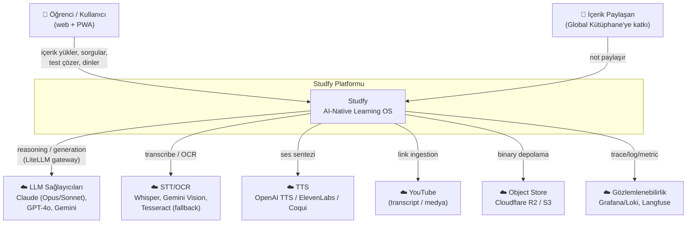

**Temel sınırlar:**

- Kullanıcı, yalnızca **kendi izole workspace**'ine erişir (hard tenant boundary — bkz. [§8](#8-çok-kiracılılık-multi-tenancy)).
- Tüm LLM/STT/TTS çağrıları **gateway üzerinden** dışarı çıkar; uygulama kodu sağlayıcıya doğrudan bağlanmaz (failover ve maliyet kontrolü için).
- Dış sağlayıcılara giden veri, **sıfır-halüsinasyon** sözleşmesi gereği yalnızca kullanıcının kendi context'i + sistem prompt'udur; model "kendi bilgisinden" yanıt üretmemeye grounding ile zorlanır.

### 1.2 Container (Seviye 2)

Çalışma zamanındaki dağıtılabilir birimler (container/deployment). Her kutu bağımsız ölçeklenir.

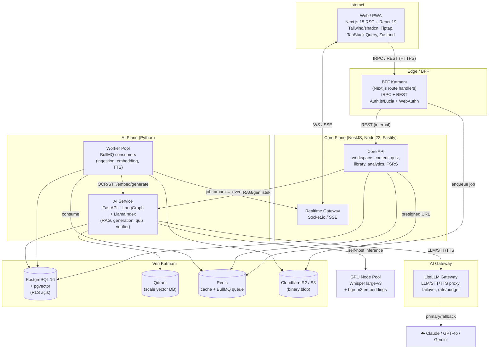

### 1.3 Component (Seviye 3) — Core API ve AI Service iç yapısı

**Core API (NestJS)** modül haritası — PRD'deki 6 modüle birebir karşılık gelir:

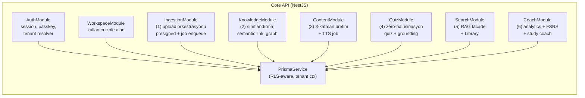

**AI Service (FastAPI + LangGraph)** — LangGraph "graph"leri olarak modellenmiş pipeline'lar:

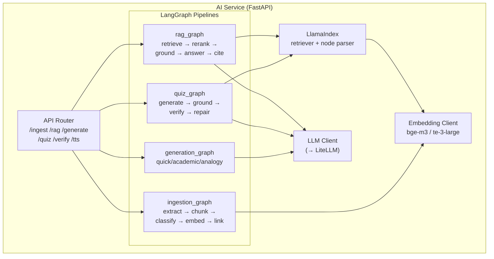

---

## 2. Servis Sınırları (Service Boundaries)

Her servisin **tek bir sorumluluk eksenine** sahip olması, bağımsız ölçeklenme ve farklı runtime (Node vs Python) kullanma ihtiyacıyla şekillenmiştir.

| Servis | Runtime / Stack | Sahiplik (Owner) | Birincil Sorumluluk | Sorumlu OLMADIĞI |
|---|---|---|---|---|
| **web** (`apps/web`) | Next.js 15, React 19, RSC, PWA | Frontend Guild | UI/UX, RSC render, istemci state (Zustand), Tiptap editör, optimistic UI (TanStack Query) | İş kuralları, DB erişimi, AI çağrıları |
| **BFF / tRPC** (`apps/web` route handlers) | tRPC + REST, Auth.js/Lucia | Frontend + Platform | Auth/session, input doğrulama (zod), tenant context çözümü, Core API'ye agregasyon/şekillendirme | Domain mantığı, ağır hesaplama |
| **core-api** (`apps/api`) | NestJS, Node 22, Fastify | Backend Guild | Domain mantığı, transaction'lı yazma, RLS-aware persistence, quota/billing, job orkestrasyonu | Model inference, embedding üretimi |
| **ai-service** (`services/ai`) | FastAPI, LangGraph, LlamaIndex | ML/AI Guild | RAG, content generation, quiz+verifier, sınıflandırma, retrieval/rerank | Kullanıcı auth, ödeme, UI |
| **worker** (BullMQ consumer) | Node 22 (BullMQ) + Python görev tetikleyiciler | Platform Guild | Uzun süren asenkron işler: ingestion, OCR/STT tetikleme, embedding, TTS, link fetch | Senkron request/response |
| **gateway** (LiteLLM) | LiteLLM proxy | Platform/ML | LLM/STT/TTS provider abstraction, failover, rate-limit, budget, prompt logging (Langfuse) | İş mantığı, retrieval |

### 2.1 Neden bu bölünme?

- **Runtime ayrımı (Node vs Python):** RAG/LLM ekosisteminin olgun kütüphaneleri (LangGraph, LlamaIndex) Python'dadır; domain/CRUD/transaction işleri için NestJS+Prisma daha üretkendir. İki dünya **HTTP/gRPC kontratı** ile ayrılır.
- **Ölçeklenme ekseni farklı:** `ai-service` CPU/GPU-bound ve latency'si yüksek; `core-api` IO-bound. Ayrı deploy = ayrı HPA profili (bkz. [§6](#6-ölçeklenebilirlik--performans)).
- **BFF ayrımı:** İstemciye özel agregasyon ve auth, domain API'den ayrı tutulur; böylece Core API saf ve test edilebilir kalır, public-facing tehdit yüzeyi BFF'te toplanır.
- **Gateway ayrımı:** Tek bir LLM provider'a kilitlenmemek (vendor lock-in) ve sağlayıcı kesintilerinde failover yapabilmek için **tüm** model trafiği LiteLLM'den geçer. Uygulama kodu "Claude" yerine "reasoning-tier model" der.
- **Worker ayrımı:** Ingestion dakikalarca sürebilir; bunu request thread'inden çıkarmak hem dayanıklılık (retry/DLQ) hem de backpressure kontrolü sağlar.

### 2.2 Servisler arası kontrat

- **web ↔ BFF:** tRPC (tip-güvenli, `packages/shared` üzerinden paylaşılan kontrat) + dosya yükleme için REST.
- **BFF ↔ core-api:** Internal REST (OpenAPI), service-to-service mTLS / imzalı internal JWT.
- **core-api ↔ ai-service:** Senkron RAG/generation için REST; bütün ağır işler **BullMQ job** üzerinden asenkron.
- **Tüm servisler ↔ gateway:** OpenAI-uyumlu API (LiteLLM).

---

## 3. Senkron vs Asenkron Akışlar

**Genel ilke:**

- **Senkron (request/response):** Kullanıcının anında cevap beklediği, < ~3 sn'lik etkileşimler — auth, RAG chat (streaming), basit okuma, küçük üretimler.
- **Asenkron (queue-based):** Uzun süren, CPU/GPU-yoğun, dış sağlayıcıya bağımlı işler — **ingestion**, OCR/STT, embedding, podcast (TTS), büyük quiz üretimi. Bunlar **BullMQ** ile kuyruğa alınır, worker'lar tüketir, sonuç **SSE/WebSocket** ile istemciye push edilir.

### 3.1 (a) Dosya Yükleme → Ingestion → Ready

Kullanıcı dosya seçer; binary doğrudan R2'ye **presigned URL** ile gider (Core API'den geçmez — bant genişliği ve bellek tasarrufu). Ardından ingestion **asenkron** ilerler.

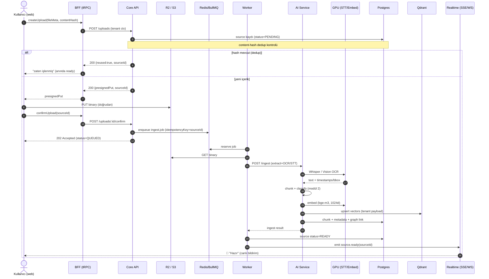

**Notlar:**

- `idempotencyKey = sourceId` → aynı confirm iki kez gelirse **tek** job çalışır (bkz. [§7](#7-dayanıklılık-resilience)).
- Pipeline aşamaları (extract → chunk → classify → embed → link) LangGraph node'larıdır; her aşama **checkpoint**'lenir, böylece kısmi başarısızlıkta baştan değil kaldığı yerden devam eder.

### 3.2 (b) RAG Chat Sorgusu + Citation'lı Yanıt

Düşük latency hedefli, **streaming** senkron akış. Retrieval Qdrant'tan, üretim grounding ile zorunlu citation üreterek yapılır.

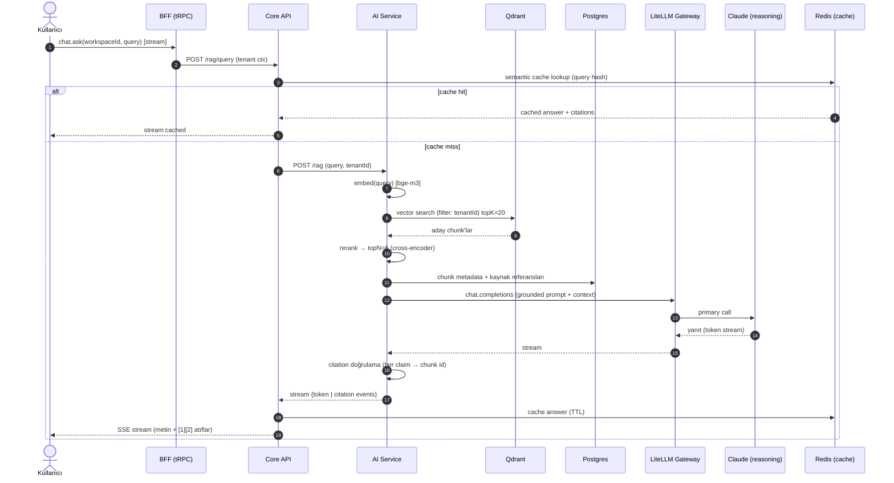

**Sıfır-halüsinasyon garantisi:** Prompt, modele "yalnızca verilen context'ten cevap ver; context yetersizse 'bu konuda notunda bilgi yok' de" talimatını verir. Üretim sonrası **citation doğrulama** node'u, her iddiayı bir chunk ID'ye bağlar; bağlanamayan cümleler işaretlenir veya yanıt reddedilir.

### 3.3 (c) Quiz Üretimi + Verifier

Quiz üretimi **iki-aşamalı** (generator + verifier) bir LangGraph akışıdır. Üretici soruyu üretir, **verifier** her sorunun cevabının kullanıcının kendi içeriğinden grounded olduğunu kanıtlar; başarısız sorular **repair** döngüsüne girer.

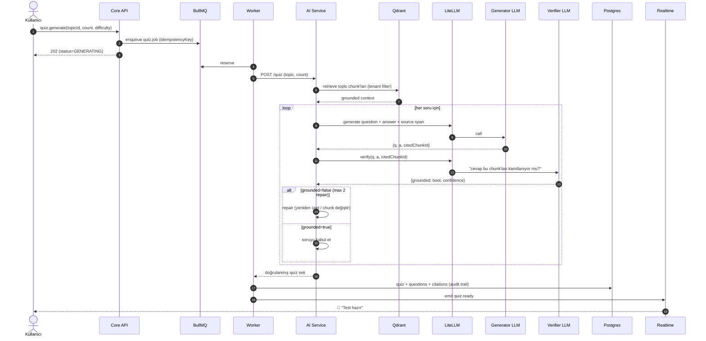

**Yanlış cevap deneyimi:** Kullanıcı yanlış yaptığında, sorunun `citedChunkId`'si kullanılarak **kaynak atfı** (PDF sayfası / ses dakikası) ve **yeniden anlatım** (analogy katmanı) gösterilir — modül 4 ↔ modül 3 entegrasyonu.

---

## 4. Veri Akışı

Sistemde dört birincil veri deposu vardır; her birinin **net bir sahiplik alanı** vardır ("single source of truth" ilkesi).

| Depo | Sahip olduğu veri (source of truth) | Türetilmiş / cache |
|---|---|---|
| **PostgreSQL 16 + pgvector** | Kullanıcı, workspace, source, chunk metadata, quiz, flashcard (FSRS state), knowledge graph kenarları, analytics olayları, library girişleri | MVP'de küçük ölçekli vektörler (pgvector) |
| **Qdrant** | (Türetilmiş) embedding vektörleri + minimal payload (chunkId, tenantId, sourceId) | Postgres'ten yeniden inşa edilebilir |
| **Redis** | (Geçici) BullMQ kuyrukları, job state, oturum/rate-limit sayaçları, semantic cache | Hiçbiri kalıcı değil — kaybolması tolere edilir |
| **R2 / S3** | Ham binary'ler (PDF, ses, video, görüntü), üretilmiş TTS/podcast dosyaları | — (binary'nin tek kopyası) |

### 4.1 Veri hareketi

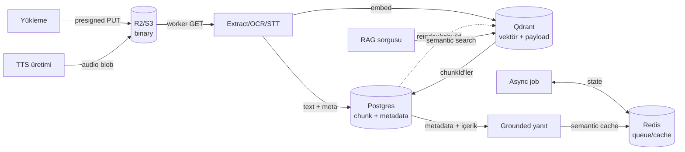

**Tutarlılık modeli:**

- **Postgres = otorite.** Qdrant ve Redis **türetilmiş**tir; ikisi de Postgres'ten yeniden inşa edilebilir (idempotent reindex job'u).
- Embedding yazımı **outbox pattern** ile yapılır: chunk Postgres'e yazılır + `vector_outbox` kaydı; worker outbox'tan okuyup Qdrant'a upsert eder → **eventual consistency**, dual-write tutarsızlığı yok.
- Binary'ler **immutable**; içerik değişirse yeni key (content-addressed, hash bazlı) yazılır.

---

## 5. Deployment Topolojisi

Hedef: **Kubernetes** (üretim) + **Fly.io/Railway** (MVP). Aşağıdaki diyagram üretim hedefini gösterir.

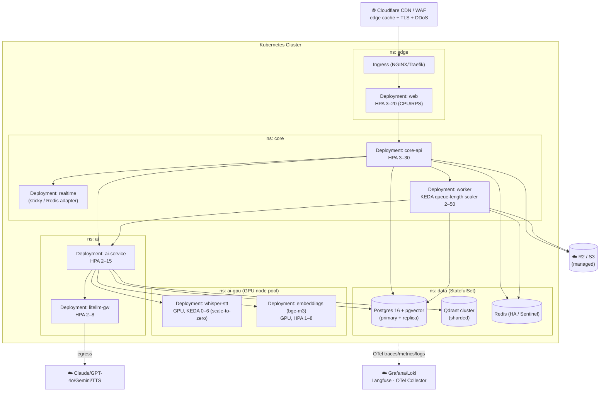

### 5.1 Namespace / Node Pool stratejisi

- **`ns: edge`** — public-facing; sıkı NetworkPolicy, yalnızca ingress'ten trafik.
- **`ns: core`, `ns: ai`** — internal; sadece kendi içinde ve veri katmanına erişir.
- **`ns: ai-gpu`** — pahalı GPU node pool'unda (`nodeSelector: gpu=true`, taint/toleration). **Whisper STT** ve **embeddings** burada; düşük talepte **scale-to-zero** (KEDA) ile maliyet sıfırlanır.
- **`ns: data`** — StatefulSet'ler; pod anti-affinity ile farklı node'lara yayılır; PVC + düzenli snapshot.

### 5.2 Autoscaling

| Bileşen | Scaler | Metrik | Min–Max |
|---|---|---|---|
| web | HPA | CPU + RPS | 3–20 |
| core-api | HPA | CPU + p95 latency | 3–30 |
| worker | **KEDA** | BullMQ kuyruk uzunluğu | 2–50 |
| ai-service | HPA | CPU + in-flight request | 2–15 |
| whisper-stt | **KEDA** (scale-to-zero) | kuyruktaki STT job | 0–6 |
| embeddings | HPA | GPU util + kuyruk | 1–8 |

### 5.3 CDN & Multi-region

- **CDN (Cloudflare):** Statik asset'ler, RSC payload cache, R2 önünde signed-URL edge cache; WAF + DDoS koruması.
- **Multi-region (yol haritası):**
  - **Stateless tier** (web, api, ai) coğrafi olarak çoklanır.
  - **Postgres**: bir region primary + read-replica'lar; yazma tek region (global write coordinator karmaşıklığından kaçınılır).
  - **Qdrant**: region başına replika; embedding'ler Postgres'ten yeniden inşa edilebildiği için disaster recovery basittir.
  - **R2**: zaten global/edge; data residency gereksinimi için bucket-per-region (KVKK/GDPR uyumu).
  - Kullanıcılar **home-region affinity** ile yönlendirilir (workspace verisi tek region'da kalır → tenant isolation + düşük latency).

---

## 6. Ölçeklenebilirlik & Performans

### 6.1 Stateless ölçekleme

- `web`, `core-api`, `ai-service`, `worker`, `litellm-gw` **tamamen stateless** → yatay ölçeklenir. Tüm durum Postgres/Redis/Qdrant/R2'de.
- **Realtime** istisna: Socket.io için **Redis adapter** ile pod'lar arası mesaj yayını; sticky session yerine fan-out.
- Oturum/auth **stateless JWT + Redis denylist** (logout/revoke).

### 6.2 Queue backpressure

- Worker'lar **kuyruk uzunluğuna** göre (KEDA) ölçeklenir; ani yük artışı kuyrukta tamponlanır, downstream (AI/GPU) ezilmez.
- Her job tipinin **ayrı kuyruğu** ve **concurrency limiti** var (`ingest`, `embed`, `tts`, `quiz`). GPU-bound kuyruklarda düşük concurrency, IO-bound kuyruklarda yüksek.
- **Rate-limiter (BullMQ):** Dış sağlayıcı (OCR/LLM) limitlerini aşmamak için job tüketim hızı sınırlandırılır.
- **Priority kuyruğu:** Kullanıcının "şimdi beklediği" işler (ör. küçük ilk dosya) yüksek öncelikli; toplu reindex düşük öncelikli.

### 6.3 Caching katmanları

| Katman | Ne | Anahtar |
|---|---|---|
| CDN edge | Statik + RSC payload | URL |
| **Content-hash dedup** | Aynı dosya/içerik tekrar yüklenirse **ingestion atlanır** | `sha256(binary)` → mevcut `sourceId` |
| Semantic cache (Redis) | Tekrar eden RAG sorgularının yanıtı | `hash(normalize(query)+tenantId)` |
| Embedding cache | Aynı chunk metni → embed tekrar üretilmez | `hash(chunkText)` |
| LLM response cache (LiteLLM) | Deterministik (temp=0) çağrılar | prompt hash |
| DB query cache | Sık okunan workspace metadata | TanStack Query (client) + Redis (server) |

> **Content-hash dedup** hem maliyet hem latency için kritiktir: global kütüphaneden çekilen popüler bir PDF, ikinci kez işlenmez; embedding ve OCR maliyeti bir kez ödenir (tenant-bazlı vektör payload'ı ayrı tutulurken, türetilmiş artefakt paylaşılabilir).

### 6.4 Connection pooling

- **Postgres:** Uygulama tarafı pool (Prisma) + **PgBouncer** (transaction mode) — yüksek pod sayısında bağlantı patlamasını önler. RLS `SET app.tenant_id` her transaction başında set edilir (bkz. [§8](#8-çok-kiracılılık-multi-tenancy)).
- **Redis:** Pod başına paylaşılan client (ioredis), pipeline + cluster-aware.
- **HTTP (servisler arası):** keep-alive agent + bounded pool; ai-service için bounded in-flight (semaphore).

### 6.5 Vector index stratejisi (HNSW)

- **Algoritma:** HNSW (hem pgvector hem Qdrant).
- **Parametreler (başlangıç):**
  - `m = 16` (graf bağlantı derecesi — recall/bellek dengesi)
  - `ef_construction = 200` (indeks kalitesi)
  - `ef_search = 64` (sorgu anında; latency/recall ayarı, sorgu tipine göre dinamik)
- **Boyut:** 1024-dim (bge-m3 / text-embedding-3-large), **cosine** mesafe.
- **Filtreleme:** Qdrant'ta `tenantId` **payload index**'i ile zorunlu pre-filter → tenant izolasyonu + arama uzayı küçülür.
- **MVP→scale geçişi:** pgvector (HNSW, tek node) → Qdrant (sharded, replicated). Geçiş **outbox reindex** ile kesintisiz; cutover read-path feature flag ile.
- **Hybrid search:** Dense (vektör) + sparse (BM25/keyword) füzyonu (RRF) → kısa/keyword sorgularda recall artışı.

### 6.6 Performans hedefleri (SLO)

| Akış | Hedef |
|---|---|
| RAG chat — ilk token | p95 < 1.2 sn |
| RAG chat — tam yanıt | p95 < 5 sn |
| Vector search (retrieve) | p95 < 120 ms |
| Küçük dosya ingestion (READY'e kadar) | p50 < 30 sn |
| Core API CRUD | p95 < 150 ms |

---

## 7. Dayanıklılık (Resilience)

### 7.1 Retry & backoff

- **Tüm job'lar** exponential backoff + jitter ile yeniden denenir (BullMQ `attempts`, `backoff`).
- **Sınıflandırma:** Geçici hatalar (429, 5xx, timeout) retry'lanır; kalıcı hatalar (4xx validation, bozuk dosya) **anında DLQ**'ya gider.
- Maks. deneme (ör. 5) sonrası DLQ.

### 7.2 Idempotency

- Her job **idempotency key** taşır (`sourceId`, `quizRequestId` vb.). Tüketici, "bu key işlendi mi?" kontrolüyle **at-least-once** delivery'i **effectively-once**'a çevirir.
- Dış yazımlar (Qdrant upsert, R2 put) **idempotent** (deterministik ID / content-addressed key) → retry güvenli.
- HTTP mutation endpoint'leri `Idempotency-Key` header'ı destekler.

### 7.3 Dead-letter queue (DLQ)

- Başarısız job'lar `*.dlq` kuyruğuna taşınır; **alert** (Grafana) + manuel/otomatik **replay** aracı.
- DLQ payload'ı orijinal job + hata + stack + attempt sayısını içerir (post-mortem için).

### 7.4 LLM sağlayıcıları için circuit breaker

- **LiteLLM gateway** sağlayıcı bazlı sağlık takibi yapar; hata oranı eşik aşınca **circuit açılır** → o sağlayıcıya trafik kesilir.
- **Failover sırası:** primary (Claude Opus/Sonnet) → secondary (GPT-4o) → tertiary (Gemini). Reasoning kalitesi tier'ına göre eşleştirilmiş model havuzu.
- **Half-open** denemelerle sağlayıcı toparlanınca otomatik geri alınır.

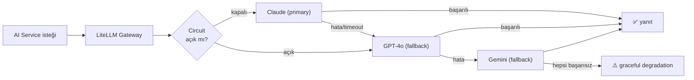

### 7.5 Graceful degradation

- **LLM tamamen erişilemezse:** RAG yine de **retrieval sonuçlarını** (kaynak parçaları + atıflar) "AI özeti şu an üretilemiyor, ilgili notların:" mesajıyla gösterir → kullanıcı yine değer alır.
- **Embeddings down:** Keyword/BM25 fallback ile arama (düşük kalite ama çalışır).
- **STT down:** Job kuyrukta bekletilir (kayıp yok), kullanıcıya "işleniyor" durumu.
- **Qdrant down:** pgvector read-replica'ya fallback (feature flag).
- **Bulkhead:** AI çağrıları izole thread pool/semaphore'da; AI yavaşlaması core-api'yi boğmaz.

### 7.6 Veri dayanıklılığı

- Postgres: streaming replication + PITR (point-in-time recovery), günlük snapshot.
- Qdrant: replicated collection + snapshot; **kaybı tolere edilebilir** (Postgres'ten reindex).
- R2: managed durability; lifecycle + versioning kritik bucket'larda.

---

## 8. Çok-kiracılılık (Multi-tenancy)

**Model:** Kullanıcı = tenant. Her kullanıcının **izole, şifreli workspace**'i var. **Hard tenant boundary** — bir kullanıcı asla başka kullanıcının verisine erişemez. İzolasyon **savunmada derinlik** (defense-in-depth) ile katmanlandırılır.

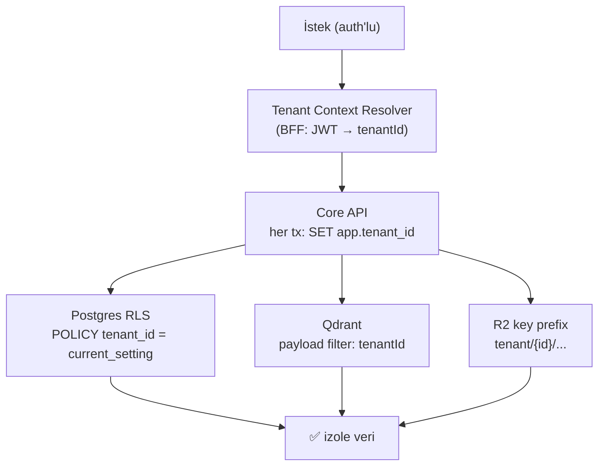

### 8.1 Postgres — Row-Level Security (RLS)

- Tenant'a ait **her tablo**da RLS açık:

  ```sql
  ALTER TABLE source ENABLE ROW LEVEL SECURITY;
  CREATE POLICY tenant_isolation ON source
    USING (tenant_id = current_setting('app.tenant_id')::uuid);
  ```

- Her transaction başında `SET LOCAL app.tenant_id = '<uuid>'` (Prisma middleware/extension). PgBouncer **transaction mode** ile uyumlu (session değil, `SET LOCAL`).
- Uygulama bug'ı bile olsa **DB seviyesinde** cross-tenant okuma imkânsız → en güçlü garanti burada.
- Veritabanı rolü `NOSUPERUSER`, `BYPASSRLS` yok.

### 8.2 Qdrant — Payload filtering

- Her vektörün payload'ında `tenantId` var; **payload index**'li.
- Tüm aramalar **zorunlu** `must: [{key: tenantId, match: <id>}]` filtresiyle yapılır (AI-service tarafında merkezi sarmalayıcı; çıplak search çağrısı yasak — lint/test ile zorlanır).
- İleride **collection-per-tenant** (büyük tenant'lar için) veya **multitenancy native** Qdrant özelliği değerlendirilir.

### 8.3 R2 / S3 — Key prefixing

- Tüm binary'ler `tenant/{tenantId}/sources/{sourceId}/...` prefix'i altında.
- Presigned URL'ler **dar kapsamlı** (tek nesne, kısa TTL) — kullanıcı yalnızca kendi nesnesinin URL'ini alır.
- IAM/bucket policy prefix bazlı; cross-prefix erişim engellenir.

### 8.4 Şifreleme & ek katmanlar

- **At rest:** Postgres/R2 disk şifreli; hassas alanlar uygulama seviyesinde envelope encryption (per-tenant data key).
- **In transit:** mTLS (internal) + TLS 1.3 (public).
- **Quota/billing izolasyonu:** Her tenant'ın kullanım sayaçları (Redis) ayrı; bir tenant kaynakları tüketse bile **fair-share** rate-limit ile diğerleri etkilenmez (noisy-neighbor önleme).
- **Audit:** Cross-tenant erişim denemeleri loglanır + alert.

---

## 9. Mimari Kararlar (ADR Özeti)

Önemli mimari kararlar [`docs/adr/`](./adr/) altında **Architecture Decision Record** formatında tutulur. Aşağıdaki ADR'ler bu doküman tarafından referanslanır (henüz yazılacak olanlar dahil):

| ADR | Başlık | Özet karar |
|---|---|---|
| [ADR-0001](./adr/0001-monorepo-turborepo.md) | Monorepo (Turborepo + pnpm) | Paylaşılan tip/kontrat (`packages/shared`) ve atomik değişiklik için tek repo. |
| [ADR-0002](./adr/0002-node-python-split.md) | Node (NestJS) + Python (FastAPI) ayrımı | Domain için Node, AI/RAG için Python; HTTP kontratı ile sınır. |
| [ADR-0003](./adr/0003-litellm-gateway.md) | LiteLLM gateway + provider failover | Vendor lock-in'i önle, circuit breaker + budget tek noktada. |
| [ADR-0004](./adr/0004-pgvector-to-qdrant.md) | pgvector (MVP) → Qdrant (scale) | Basit başla, outbox reindex ile kesintisiz geçiş. |
| [ADR-0005](./adr/0005-bullmq-async-ingestion.md) | BullMQ ile asenkron ingestion | Uzun işleri request'ten ayır; KEDA ile backpressure. |
| [ADR-0006](./adr/0006-postgres-rls-multitenancy.md) | RLS ile çok-kiracılılık | Hard boundary'yi DB seviyesinde garanti et. |
| [ADR-0007](./adr/0007-zero-hallucination-rag.md) | Sıfır-halüsinasyon grounding + verifier | Citation zorunluluğu + quiz verifier döngüsü. |
| [ADR-0008](./adr/0008-presigned-direct-upload.md) | R2'ye doğrudan presigned upload | Binary API'den geçmez; bellek/bant tasarrufu + dedup. |
| [ADR-0009](./adr/0009-trpc-bff.md) | tRPC tabanlı BFF | Uçtan uca tip güvenliği, ince istemci kontratı. |
| [ADR-0010](./adr/0010-observability-otel-langfuse.md) | OTel + Langfuse gözlemlenebilirlik | Dağıtık trace + LLM-özel izleme/eval. |

> Her ADR; **Context → Decision → Consequences** yapısını izler. Yeni bir mimari karar verildiğinde önce ADR yazılır, sonra bu tablo güncellenir.

---

## 10. Teknoloji Trade-off Tablosu

| Alan | Seçim | Alternatif(ler) | Neden bu seçim | Bedeli / Trade-off |
|---|---|---|---|---|
| Frontend framework | **Next.js 15 (App Router, RSC)** | Remix, SvelteKit, SPA+Vite | RSC ile sunucu-render + düşük JS, olgun ekosistem, PWA | RSC mental model dik öğrenme eğrisi |
| BFF | **tRPC + REST** | GraphQL, sadece REST | Uçtan uca tip güvenliği, sıfır kod-üretimi | TS-only; non-TS istemci dostu değil (REST ile telafi) |
| Core API | **NestJS / Fastify (Node 22)** | Express, Go, Spring | Modüler DI, Prisma uyumu, Fastify hızı | Node CPU-bound işlerde zayıf (→ AI'ya devredildi) |
| AI servisi | **FastAPI + LangGraph + LlamaIndex** | LangChain-only, kendi orkestrasyon | Olgun RAG/agent araçları, graph-checkpoint | Python ops ayrı runtime; GIL/CPU yönetimi |
| LLM erişimi | **LiteLLM gateway** | Doğrudan SDK, OpenRouter | Provider-agnostik, failover, budget, log | Ekstra hop (latency ~), gateway bir SPOF → HA gerek |
| Birincil LLM | **Claude (Opus/Sonnet)** | GPT-4o, Gemini, OSS | Güçlü reasoning, grounding'e uyumlu, uzun context | Maliyet; failover ile diğerleri devrede |
| İlişkisel DB | **PostgreSQL 16** | MySQL, CockroachDB | RLS, pgvector, olgunluk, JSONB | Tek-yazar ölçekleme sınırı (read-replica ile hafifler) |
| Vektör (MVP) | **pgvector** | Pinecone, Weaviate | Aynı DB, tek operasyon, transaction | Ölçekte index/recall sınırı → Qdrant'a geçiş |
| Vektör (scale) | **Qdrant** | Milvus, Pinecone | Sharding, payload filter, self-host | Ek operasyonel yük, ayrı tutarlılık |
| Embedding | **bge-m3 / text-embedding-3-large (1024d)** | OpenAI-only, e5 | Çok-dilli (TR güçlü), self-host opsiyonu | GPU maliyeti (self-host) vs API maliyeti |
| Cache/Queue | **Redis + BullMQ** | RabbitMQ, Kafka, SQS | Tek bağımlılık, hız, BullMQ DX | Kalıcı log/event-sourcing için zayıf (Kafka değil) |
| Object store | **Cloudflare R2 / S3** | MinIO self-host | Sıfır egress (R2), global, managed | Vendor; data residency için bucket-per-region |
| STT | **Whisper large-v3 (self-host GPU)** | Deepgram, AssemblyAI API | Maliyet, gizlilik, kontrol | GPU operasyon + scale-to-zero karmaşıklığı |
| OCR/Vision | **Gemini Vision / GPT-4o + Tesseract fallback** | Yalnız Tesseract, AWS Textract | El yazısı/karmaşık layout'ta LLM-vision üstün | Maliyet → kolay sayfalarda Tesseract'a düş |
| TTS | **OpenAI TTS / ElevenLabs / Coqui XTTS** | Tek sağlayıcı | Kalite/maliyet dengesi + self-host opsiyonu | Çok sağlayıcı = ekstra abstraction |
| Auth | **Auth.js/Lucia + WebAuthn/passkey** | Clerk, Auth0, Firebase | Self-host, passkey-first, ücretsiz | Daha fazla kendin-yönet sorumluluğu |
| Realtime | **Socket.io / SSE** | Ably, Pusher, raw WS | RAG streaming (SSE) + bildirim (WS), Redis adapter | Ölçekte fan-out yönetimi |
| Orkestrasyon | **Kubernetes (+ Fly/Railway MVP)** | Yalnız PaaS, Nomad | GPU pool, HPA/KEDA, çok-region esnekliği | K8s operasyonel karmaşıklık (MVP'de PaaS ile ertelendi) |
| Gözlemlenebilirlik | **OTel + Grafana/Loki + Langfuse** | Datadog, New Relic | Açık standart, LLM-özel eval (Langfuse), maliyet | Kendin-host operasyon yükü |

---

### Ekler

- **Sıfır-halüsinasyon sözleşmesi:** Tüm generation/RAG/quiz akışları, çıktının kullanıcının kendi context'ine **bağlanabilir (grounded)** olmasını zorunlu kılar; bağlanamayan içerik üretilmez veya açıkça "notunda bu bilgi yok" olarak işaretlenir.
- **Sıralı evrim:** MVP (Fly/Railway + pgvector + tek-region) → Scale (K8s + Qdrant + GPU pool + multi-region). Mimari, bu geçişlerin **kesintisiz** olması için outbox/feature-flag/türetilmiş-veri ilkeleriyle tasarlanmıştır.
