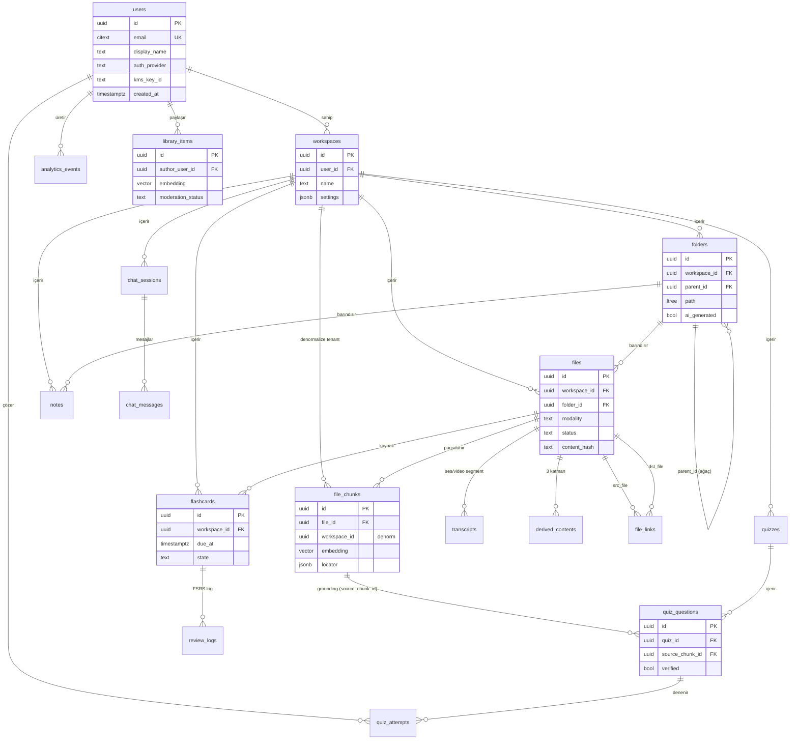

# Studfy — Veri Tabanı Dokümantasyonu (DATABASE.md)

> AI-Native Öğrenme İşletim Sistemi — PostgreSQL veri modeli, indeksleme, vektör depolama, çok-kiracılılık (multi-tenancy), yaşam döngüsü ve operasyon stratejisi.

| | |
|---|---|
| **Veritabanı** | PostgreSQL 16+ |
| **Eklentiler** | `vector` (pgvector), `ltree`, `pgcrypto`, `citext` |
| **ORM** | Prisma (`apps/api/prisma/schema.prisma`) |
| **Raw migration** | `infra/db/migrations/0001_init.sql` |
| **Vektör boyutu** | 1024 (embedding modeli ile hizalı) |
| **Sürüm** | 1.0 |

---

## 1. Genel Bakış & ER Diyagramı

Studfy verisi **kullanıcı (tenant) izolasyonu** etrafında modellenir. Her şey `users → workspaces` zincirinden türer; `workspace_id` neredeyse tüm tablolarda kira (tenant) sınırını çizen anahtardır. RLS (Row-Level Security) bu sınırı veritabanı düzeyinde zorunlu kılar.

Tasarımın üç teknik direği:

1. **pgvector** — RAG için semantik arama (`file_chunks`, `notes`, `library_items` embedding kolonları).
2. **ltree** — `folders.path` ile hızlı ağaç/alt-ağaç sorguları.
3. **Strict grounding** — `quiz_questions.source_chunk_id` ve `chat_messages.citations` ile sıfır-halüsinasyon kaynak atfı.



---

## 2. Tablo Tablo Veri Sözlüğü

> Tüm `id` kolonları `UUID DEFAULT gen_random_uuid()` (istisna: `analytics_events.id = BIGSERIAL`). Tüm zaman damgaları `TIMESTAMPTZ`.

### 2.1 `users` — Kimlik
**Amaç:** Her kimlik doğrulanmış kullanıcı için tek satır. Tüm tenant zincirinin kökü.

| Kolon | Tip | Kısıt | Neden |
|---|---|---|---|
| `id` | uuid | PK | Genel kimlik |
| `email` | citext | UNIQUE NOT NULL | `citext` → büyük/küçük harf duyarsız tekillik (`Ali@x.com` = `ali@x.com`) |
| `display_name` | text | | Görünen ad |
| `auth_provider` | text | | `passkey` / `google` / `email` |
| `kms_key_id` | text | | Per-user envelope encryption anahtar referansı (zero-knowledge izolasyon) |
| `created_at` | timestamptz | DEFAULT now() | |

### 2.2 `workspaces` — Kira (Tenant) Sınırı
**Amaç:** Kullanıcının izole, şifreli veri alanı. RLS sınırı.

| Kolon | Tip | Kısıt | Neden |
|---|---|---|---|
| `id` | uuid | PK | |
| `user_id` | uuid | FK→users ON DELETE CASCADE | Kullanıcı silinince alan da silinir (GDPR) |
| `name` | text | NOT NULL DEFAULT 'Çalışma Alanım' | |
| `settings` | jsonb | DEFAULT '{}' | Esnek kullanıcı tercihleri |
| `created_at` | timestamptz | DEFAULT now() | |

### 2.3 `folders` — Klasör Ağacı
**Amaç:** Otomatik tasnif hedefi; hiyerarşik ağaç. `path` ile hızlı alt-ağaç sorgusu.

| Kolon | Tip | Kısıt | Neden |
|---|---|---|---|
| `id` | uuid | PK | |
| `workspace_id` | uuid | FK→workspaces CASCADE | Tenant |
| `parent_id` | uuid | FK→folders(self) CASCADE | Ağaç yapısı |
| `name` | text | NOT NULL | "İleri Matematik" / "Türev" |
| `ai_generated` | bool | DEFAULT false | AI mı kullanıcı mı oluşturdu |
| `path` | ltree | | `root.matematik.turev` — GiST ile O(log n) alt-ağaç |
| `created_at` | timestamptz | DEFAULT now() | |

### 2.4 `files` — Multimodal Dosyalar
**Amaç:** Tüm modalitelerde yüklenen kaynak varlıklar; ingestion pipeline'ını sürer.

| Kolon | Tip | Kısıt / Değerler | Neden |
|---|---|---|---|
| `id` | uuid | PK | |
| `workspace_id` | uuid | FK→workspaces CASCADE | Tenant |
| `folder_id` | uuid | FK→folders ON DELETE SET NULL | Klasör silinince dosya yetim kalmasın |
| `original_name` | text | NOT NULL | |
| `mime_type` | text | NOT NULL | |
| `modality` | text | `document\|image\|handwriting\|audio\|video` | İşleme yönlendirici |
| `storage_key` | text | NOT NULL | R2/S3 şifreli yol |
| `content_hash` | text | | Duplicate tespiti (indeksli) |
| `size_bytes` | bigint | | |
| `status` | text | `queued\|extracting\|embedding\|ready\|failed` | Canlı durum (WebSocket) |
| `detected_course/topic/subtopic` | text | | AI tasnif çıktısı |
| `classify_confidence` | real | | Tasnif güveni |
| `tags` | text[] | | GIN indeksli etiketler |
| `language` | text | | |
| `duration_sec` | int | | Ses/video |
| `page_count` | int | | PDF |
| `created_at` | timestamptz | DEFAULT now() | |

### 2.5 `file_chunks` — RAG Birimi (pgvector)
**Amaç:** Normalize, parçalanmış metin birimleri. Atomik RAG retrieval birimi.

| Kolon | Tip | Kısıt | Neden |
|---|---|---|---|
| `id` | uuid | PK | |
| `file_id` | uuid | FK→files CASCADE | |
| `workspace_id` | uuid | NOT NULL (denormalize) | Join'siz tenant filtresi → vektör aramada RLS ucuz kalır |
| `chunk_index` | int | | Sıralama |
| `content` | text | NOT NULL | |
| `locator` | jsonb | | `{page,paragraph}` \| `{start_sec}` — derin link |
| `token_count` | int | | Bütçe/maliyet |
| `embedding` | vector(1024) | | HNSW cosine indeksli |
| `created_at` | timestamptz | DEFAULT now() | |

### 2.6 `transcripts` — Ses/Video Segmentleri
**Amaç:** Zaman damgalı transkript; "14:32'de" araması.

| Kolon | Tip | Neden |
|---|---|---|
| `id` | uuid PK | |
| `file_id` | uuid FK→files CASCADE | |
| `start_sec` / `end_sec` | real | Segment penceresi |
| `speaker` | text | Diarization |
| `text` | text | |

### 2.7 `derived_contents` — 3 Katmanlı Türetilmiş İçerik
**Amaç:** Dosya başına AI anlatım katmanları (her katman tek satır).

| Kolon | Tip | Kısıt | Neden |
|---|---|---|---|
| `id` | uuid | PK | |
| `file_id` | uuid | FK→files CASCADE | |
| `layer` | text | `quick_glance\|academic\|analogy` | |
| `format` | text | DEFAULT 'markdown' | |
| `content` | text | | |
| `audio_key` | text | | TTS/podcast çıktısı (R2) |
| `model_used` | text | | İzlenebilirlik |
| | | **UNIQUE(file_id, layer)** | Katman başına tek üretim |

### 2.8 `file_links` — Bilgi Grafiği Kenarları
**Amaç:** Dosyalar arası semantik ilişki (literatür haritası).

| Kolon | Tip | Değerler | Neden |
|---|---|---|---|
| `id` | uuid PK | | |
| `src_file` / `dst_file` | uuid FK→files CASCADE | | Yönlü kenar |
| `relation` | text | `supports\|contradicts\|extends\|duplicate` | |
| `score` | real | | İlişki gücü |
| `ai_suggested` | bool DEFAULT true | | AI mı önerdi |
| `accepted` | bool | | Kullanıcı onayı |

### 2.9 `notes` — Notlar (pgvector)
**Amaç:** Tiptap blok-JSON notlar; kendi embedding'i ile semantik aranabilir.

| Kolon | Tip | Neden |
|---|---|---|
| `id` | uuid PK | |
| `workspace_id` | uuid FK CASCADE | Tenant |
| `folder_id` | uuid FK SET NULL | |
| `title` | text | |
| `doc` | jsonb | Tiptap doküman |
| `embedding` | vector(1024) | HNSW indeksli |
| `created_at` / `updated_at` | timestamptz | `updated_at` @updatedAt |

### 2.10 `quizzes` / `quiz_questions` / `quiz_attempts` — Test Motoru
**Amaç:** Sıfır-halüsinasyon, kaynağa bağlı (grounded) test üretimi ve denemeler.

`quizzes`:

| Kolon | Tip | Değerler |
|---|---|---|
| `id` | uuid PK | |
| `workspace_id` | uuid FK CASCADE | |
| `title` | text | |
| `source_file_ids` | uuid[] | Üretim kaynağı |
| `mode` | text | `practice\|exam` |

`quiz_questions`:

| Kolon | Tip | Değerler | Neden |
|---|---|---|---|
| `id` | uuid PK | | |
| `quiz_id` | uuid FK CASCADE | | |
| `type` | text | `mcq\|true_false\|fill_blank\|match\|open` | |
| `stem` / `options` / `answer` / `explanation` | text/jsonb | | |
| `source_chunk_id` | uuid FK→file_chunks SET NULL | | **ZORUNLU grounding** — soru bir chunk'tan türer |
| `source_locator` | jsonb | | Atıf için konum |
| `difficulty` | real | | |
| `topic` | text | | |
| `verified` | bool DEFAULT false | | Verifier-LLM onayı |

`quiz_attempts`:

| Kolon | Tip | Neden |
|---|---|---|
| `id` | uuid PK | |
| `question_id` | uuid FK CASCADE | |
| `user_id` | uuid FK SET NULL | |
| `given_answer` | jsonb | |
| `is_correct` | bool | |
| `time_spent_ms` | int | Analitik/koçluk |
| `created_at` | timestamptz | |

### 2.11 `flashcards` / `review_logs` — Spaced Repetition (FSRS)
**Amaç:** FSRS algoritması ile aralıklı tekrar.

`flashcards`:

| Kolon | Tip | Değerler | Neden |
|---|---|---|---|
| `id` | uuid PK | | |
| `workspace_id` | uuid FK CASCADE | | |
| `file_id` | uuid FK SET NULL | | Kaynak dosya |
| `front` / `back` / `cloze` | text | | Kart yüzleri |
| `stability` / `difficulty` | real | | FSRS parametreleri |
| `due_at` | timestamptz | | Tekrar zamanı (kompozit indeks) |
| `state` | text DEFAULT 'new' | `new\|learning\|review\|relearning` | |
| `reps` / `lapses` | int | | Tekrar/başarısızlık sayacı |

`review_logs`:

| Kolon | Tip | Kısıt | Neden |
|---|---|---|---|
| `id` | uuid PK | | |
| `card_id` | uuid FK CASCADE | | |
| `rating` | smallint | CHECK 1..4 | 1 again, 2 hard, 3 good, 4 easy |
| `reviewed_at` | timestamptz | DEFAULT now() | |

### 2.12 `chat_sessions` / `chat_messages` — Asistan (Strict RAG)
`chat_sessions`:

| Kolon | Tip | Neden |
|---|---|---|
| `id` | uuid PK | |
| `workspace_id` | uuid FK CASCADE | |
| `scope` | jsonb | `{file_ids\|folder_id\|all}` retrieval kapsamı |

`chat_messages`:

| Kolon | Tip | Neden |
|---|---|---|
| `id` | uuid PK | |
| `session_id` | uuid FK CASCADE | |
| `role` | text | `user\|assistant\|system` |
| `content` | text | |
| `citations` | jsonb | `[{chunk_id, locator}]` — zorunlu atıf |
| `tokens` | int | Maliyet |

### 2.13 `analytics_events` — Olay Akışı (Partitioned)
**Amaç:** Yüksek hacimli, append-only olay akışı. `created_at`'e göre RANGE partition.

| Kolon | Tip | Neden |
|---|---|---|
| `id` | bigserial | uuid'den ucuz, hacim çok yüksek |
| `user_id` / `workspace_id` | uuid | Filtre (FK yok — append performansı) |
| `event_type` / `topic` | text | |
| `payload` | jsonb | Esnek olay gövdesi |
| `created_at` | timestamptz | Partition anahtarı |
| | | PK = `(id, created_at)` — partition anahtarı PK'ye dahil olmalı |

### 2.14 `library_items` — Global Kütüphane (pgvector)
**Amaç:** Topluluk tarafından paylaşılan, opt-in öğrenme içerikleri. Tenant-izole **değil** (global okuma).

| Kolon | Tip | Değerler | Neden |
|---|---|---|---|
| `id` | uuid PK | | |
| `author_user_id` | uuid FK SET NULL | | Anonimlikte yazar gizli |
| `anonymous` | bool DEFAULT false | | |
| `title` / `description` / `content` | text | | |
| `course` / `topic` | text | | İndeksli filtre |
| `tags` | text[] | | GIN |
| `embedding` | vector(1024) | | Global semantik arama (HNSW) |
| `license` | text | | |
| `upvotes` / `import_count` | int | | Popülerlik |
| `moderation_status` | text DEFAULT 'pending' | `pending\|approved\|rejected` | Moderasyon kapısı |

---

## 3. İndeksleme Stratejisi

| Tip | Nerede | Amaç |
|---|---|---|
| **B-tree** | Tüm FK kolonları, `files.status`, `files.content_hash`, `flashcards(workspace_id, due_at)`, `analytics_events.created_at` | Eşitlik/aralık sorguları, JOIN'ler, due-kart kuyruğu |
| **GIN (jsonb)** | `file_chunks.locator` | `locator @> '{...}'` containment sorguları |
| **GIN (array)** | `files.tags`, `library_items.tags` | `tags && '{...}'` etiket araması |
| **HNSW (vector)** | `file_chunks.embedding`, `notes.embedding`, `library_items.embedding` | ANN cosine semantik arama |
| **GiST (ltree)** | `folders.path` | Alt-ağaç (`@>`), ata (`<@`), lquery (`~`) |

### 3.1 HNSW Parametreleri
```sql
CREATE INDEX ... USING hnsw (embedding vector_cosine_ops)
  WITH (m = 16, ef_construction = 64);
```
- **`m = 16`** — her düğümün graf derecesi. Yüksek `m` → daha iyi recall, daha çok bellek. 16 dengeli varsayılan.
- **`ef_construction = 64`** — inşa sırasında değerlendirilen aday sayısı; build kalitesi/süresi dengesi.
- **Sorgu zamanı:** `SET hnsw.ef_search = 40;` (recall/latency ayarı; partial: oturum bazında artırılabilir).
- **Mesafe operatörü:** cosine için `<=>`. Embedding'ler normalize edilirse cosine ≈ inner product.
- **Filtreli arama:** `WHERE workspace_id = $1 ORDER BY embedding <=> $2 LIMIT k`. Denormalize `workspace_id` sayesinde tenant filtresi indeks taramasından önce daraltma sağlar; gerekirse partial/ölçekte Qdrant payload filtresine devredilir.

### 3.2 ltree (GiST)
`folders.path` materialized path tutar (örn. `root.matematik.turev`). Bir alt ağacın tüm dosyaları:
```sql
SELECT f.* FROM folders fo JOIN files f ON f.folder_id = fo.id
WHERE fo.path <@ 'root.matematik';   -- GiST indeksli, O(log n)
```

---

## 4. Vektör Depolama — pgvector (MVP) vs Qdrant (Scale)

| | **pgvector (MVP)** | **Qdrant (Scale)** |
|---|---|---|
| Konum | Postgres içinde, embedding kolonu | Ayrı vektör servisi |
| Avantaj | Tek veri kaynağı, transactional tutarlılık, basit ops | Yatay ölçek, hızlı filtreli ANN, quantization, sharding |
| Ne zaman | < ~1-5M chunk, tek node yeter | Hacim/QPS pgvector latency'sini zorlayınca |
| İndeks | HNSW (m=16, ef_construction=64) | HNSW + payload index |

### 4.1 Mirror (Aynalama) Stratejisi
- **Tek yazıcı (source of truth = Postgres):** Chunk yazıldığında embedding hem `file_chunks.embedding` kolonuna hem de iş kuyruğu (BullMQ) aracılığıyla Qdrant'a upsert edilir.
- **Idempotent upsert:** Qdrant point id = `file_chunks.id` (uuid). Yeniden işleme güvenli.
- **Geri dönüş (fallback):** Qdrant erişilemezse arama pgvector'a düşer (degrade-but-available).
- **Reconciliation:** Periyodik job, son `created_at`'ten itibaren Postgres↔Qdrant sayım/diff kontrolü yapar.

### 4.2 Qdrant Payload Şeması
```jsonc
// Qdrant collection: "studfy_chunks", vectors: { size: 1024, distance: "Cosine" }
{
  "id": "<file_chunks.id uuid>",
  "vector": [/* 1024 float */],
  "payload": {
    "workspace_id": "<uuid>",   // tenant filter (indexed keyword)
    "file_id": "<uuid>",        // indexed keyword
    "chunk_index": 12,
    "modality": "document",     // files.modality (denorm)
    "course": "Matematik",      // detected_course (denorm)
    "topic": "Türev",
    "locator": { "page": 14, "paragraph": 3 },
    "token_count": 312,
    "created_at": "2026-06-27T10:00:00Z"
  }
}
```
- `workspace_id`, `file_id`, `course`, `topic` payload alanları **indexed** (filtreli ANN için).
- Tenant izolasyonu Qdrant'ta her sorguya zorunlu `must: [{ key: "workspace_id", match: <uuid> }]` filtresi ile sağlanır (uygulama katmanı asla atlamaz).

---

## 5. Çok-Kiracılılık (Multi-Tenancy) & RLS

**Model:** Shared-database / shared-schema; izolasyon `workspace_id` + Postgres RLS.

### 5.1 Oturum Deseni
Uygulama her istek/işlem başında kullanıcıyı bağlar:
```sql
SET LOCAL app.user_id = '<uuid>';   -- transaction-scoped, connection pool güvenli
```
- `SET LOCAL` kullanılır → PgBouncer transaction pooling'de connection sızıntısı olmaz.
- Uygulama rolü **superuser değildir** ve **BYPASSRLS yetkisi yoktur**.

### 5.2 Politika Deseni
İki tip politika:
1. **Doğrudan sahiplik** (`workspaces`): `user_id = current_setting('app.user_id', true)::uuid`.
2. **Türetilmiş** (folders, files, file_chunks, notes, quizzes, flashcards, chat_sessions):
```sql
USING (workspace_id IN (
  SELECT id FROM workspaces WHERE user_id = current_setting('app.user_id', true)::uuid))
```
- `current_setting('app.user_id', true)` — ikinci argüman `true` → değişken set edilmemişse hata yerine NULL döner (NULL ile karşılaştırma satır döndürmez → güvenli kapalı).
- Tüm RLS tablolarında `FORCE ROW LEVEL SECURITY` → tablo sahibine de uygulanır.
- `WITH CHECK` ile yazma (INSERT/UPDATE) da aynı tenant'a kısıtlanır.

### 5.3 Notlar
- `file_chunks` denormalize `workspace_id` ile **join'siz** RLS → en yüksek kardinaliteli ve vektör-arama yolundaki tabloda ucuz politika.
- `library_items` bilinçli olarak **RLS dışı** (global okuma). Görünürlük uygulama katmanında `moderation_status = 'approved'` ile sağlanır.
- `analytics_events` RLS dışı (yalnız backend/servis rolü yazar; analitik sorguları ayrı, kısıtlı rol).

---

## 6. Veri Yaşam Döngüsü

### 6.1 Soft Delete vs Hard Delete
- **Hard delete + CASCADE** ana hat: kullanıcı bir dosyayı silince `file_chunks`, `transcripts`, `derived_contents`, `file_links` CASCADE ile gider — yetim veri kalmaz, embedding'ler temizlenir.
- **Soft delete** (opsiyonel, UI "Çöp Kutusu" için): `files`/`notes` üzerine `deleted_at TIMESTAMPTZ` eklenip 30 gün saklama; partial index `WHERE deleted_at IS NULL`. (MVP'de hard delete; soft delete iyileştirme olarak işaretli.)

### 6.2 Cascade Kuralları (özet)
| İlişki | Davranış | Gerekçe |
|---|---|---|
| users → workspaces | CASCADE | Hesap silinince her şey gider (GDPR) |
| workspaces → folders/files/notes/... | CASCADE | Tenant temizliği |
| folders → files | **SET NULL** | Klasör silinince dosya yetim kalmasın |
| files → file_chunks/transcripts/derived/links | CASCADE | Türev veri kaynağa bağlı |
| file_chunks → quiz_questions.source_chunk_id | **SET NULL** | Chunk silinse de soru kalır, grounding kopar (verified=false'a düşürülür) |
| flashcards.file_id | SET NULL | Kart, kaynak silinince yaşar |

### 6.3 Saklama (Retention)
- `analytics_events`: 13 ay; eski partition'lar `DETACH` + arşiv (S3/Parquet) veya `DROP`.
- `chat_messages`: kullanıcı tercihiyle; varsayılan süresiz, "geçmişi temizle" hard delete.
- `review_logs`: süresiz (FSRS doğruluğu için tarihçe gerekli).

### 6.4 GDPR / KVKK Silme
- **Right to erasure:** `DELETE FROM users WHERE id = $1` → CASCADE tüm tenant verisini siler.
- **Şifreleme ile kripto-silme:** Per-user `kms_key_id` anahtarının iptali, object storage'daki şifreli dosyaları (R2/S3) okunamaz kılar — fiziksel silmeden önce anında etkisizleştirir.
- **Export everything:** Silmeden önce kullanıcı tüm verisini dışa aktarabilir (veri taşınabilirliği ilkesi).
- `library_items`: yazar silinince `author_user_id` SET NULL + `anonymous=true`; içerik (topluluk katkısı) kalabilir veya tercihe göre kaldırılır.

---

## 7. Performans

### 7.1 Partitioning
- `analytics_events` → **RANGE partition by `created_at`** (aylık). Yararı: küçük indeksler, partition pruning ile hızlı zaman aralığı sorguları, eski veriyi `DROP PARTITION` ile O(1) temizleme.
- Partition yönetimi: `pg_partman` veya zamanlanmış job ile bir sonraki ayın partition'ı önceden oluşturulur; `analytics_events_default` catch-all aralık dışı satırlarda insert'in patlamasını önler.

### 7.2 Connection Pooling (PgBouncer)
- **Transaction pooling** modu önerilir (yüksek eşzamanlılık). Bu nedenle:
  - Tenant bağlamı `SET LOCAL` (session değil) ile verilir.
  - Prepared statement / session-scoped state'e güvenilmez.
- App ↔ PgBouncer ↔ Postgres. Pool: ~ (çekirdek sayısı × 2-4) gerçek bağlantı.

### 7.3 Denormalizasyon Gerekçesi
- `file_chunks.workspace_id` — `files`'a join etmeden tenant filtresi; vektör arama + RLS sıcak yolunda kritik kazanç.
- Qdrant payload'unda `course`/`topic`/`modality` denormalize → filtreli ANN tek serviste.

### 7.4 Diğer
- HNSW indeksleri çok bellek tüketir → embedding tabloları için yeterli `shared_buffers` / `maintenance_work_mem` (build sırasında).
- Hot path indeksleri: `flashcards(workspace_id, due_at)` (due kuyruğu), `files(status)` (worker pickup).

---

## 8. Migrasyon Stratejisi

İki katmanlı, **sıralı** yaklaşım:

1. **Raw SQL (önce):** `infra/db/migrations/0001_init.sql`
   - `CREATE EXTENSION` (vector, ltree, pgcrypto, citext).
   - HNSW / GiST / GIN indeksleri (Prisma `Unsupported()` kolonlarına indeks oluşturamaz).
   - RLS enable + policy'ler.
   - `analytics_events` partition tanımları.
2. **Prisma migrate:** `schema.prisma` tablo şeması ve B-tree indeksleri.
   - `previewFeatures = ["postgresqlExtensions"]` + `extensions = [vector, ltree, pgcrypto, citext]`.
   - `vector(1024)` ve `ltree` → `Unsupported(...)` ile temsil edilir; bu kolonların indeksleri **raw SQL'de** yaşar.

**Senkronizasyon kuralı:** `schema.prisma` ile `0001_init.sql` aynı kolon adları/tiplerini paylaşmalı. Vektör/ltree/GIN/RLS gibi Prisma'nın bilmediği her şey raw SQL'e ait. CI'da `prisma migrate diff` ile drift kontrolü; Prisma'nın yönetmediği objeler (policy, hnsw index, partition) için ayrı raw migration zinciri (`0002_...`, `0003_...`).

**Pratik akış:**
```bash
psql "$DATABASE_URL" -f infra/db/migrations/0001_init.sql   # extensions + RLS + vector idx
npx prisma migrate deploy                                    # tablolar + b-tree
```

---

## 9. Backup & DR (Felaket Kurtarma)

| Katman | Strateji |
|---|---|
| **PITR** | WAL arşivleme + base backup (`pgBackRest` / managed PITR). RPO ≈ dakikalar, son tutarlı ana geri dönüş. |
| **Günlük snapshot** | Yönetilen Postgres otomatik snapshot, ≥ 7-30 gün saklama. |
| **Mantıksal yedek** | Haftalık `pg_dump` (şema + veri), şifreli object storage'a; ofsayt/cross-region kopya. |
| **Object storage (R2/S3)** | Versioning + cross-region replication; dosyalar zaten per-user şifreli. |
| **Qdrant** | Snapshot API ile düzenli; ama **kaynak Postgres** olduğundan tamamen yeniden inşa edilebilir (re-embed gerekmeden kolon → upsert). |
| **DR tatbikatı** | Çeyrek dönemde restore testi; RTO hedefi ölçülür. |

**Tutarlılık notu:** Vektör verisinin source-of-truth'u Postgres olduğundan, Qdrant kaybı veri kaybı değildir — yeniden upsert ile düzelir. Asıl korunması gereken Postgres (PITR) ve object storage'tır.

---

### Ek: İlgili Dosyalar
- Prisma şema: `apps/api/prisma/schema.prisma`
- Raw init migration: `infra/db/migrations/0001_init.sql`
- Ürün gereksinimleri: `docs/PRD.md` (§5 Veri Tabanı Şeması)
