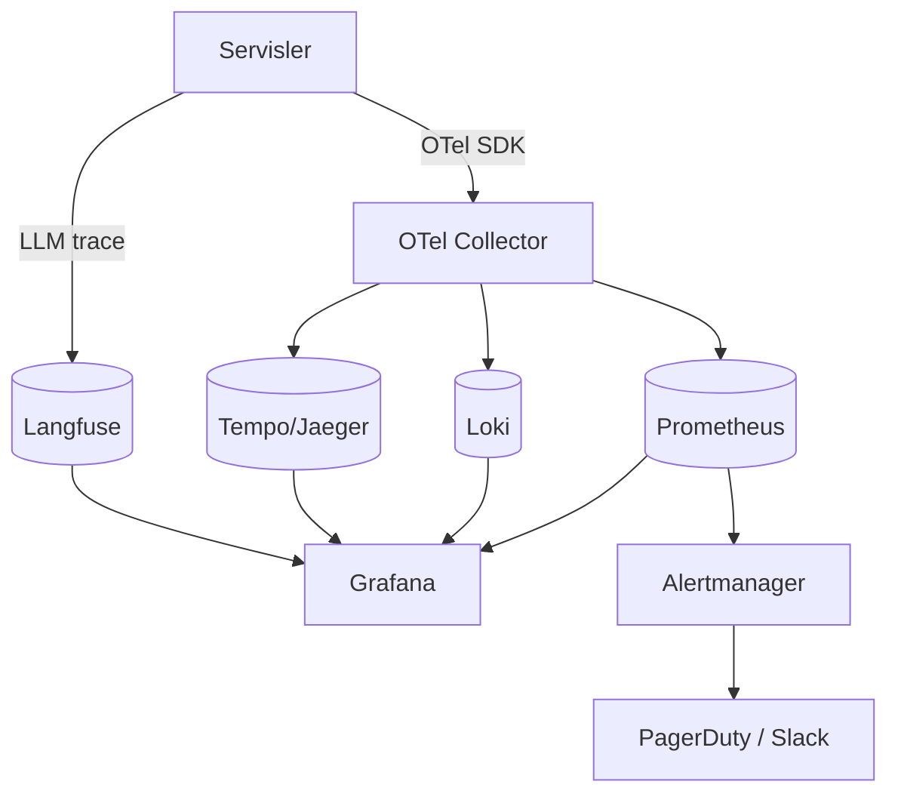
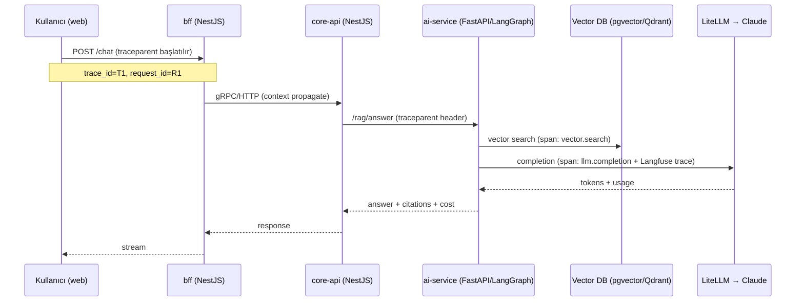

# Studfy — Gözlemlenebilirlik (OBSERVABILITY)

> Metrics, logs, traces üç sütunu; OpenTelemetry tabanlı uçtan uca izlenebilirlik; LLM/RAG'a özel maliyet ve kalite gözlemlenebilirliği (Langfuse); SLO/SLI, alerting ve on-call runbook'ları.

| | |
|---|---|
| **Doküman Sürümü** | 1.0 |
| **Durum** | Aktif |
| **Sahip** | Platform / SRE Lead |
| **İlişkili** | [ROADMAP.md](./ROADMAP.md), [TESTING.md](./TESTING.md), [PRD.md](./PRD.md) |

---

## 0. İçindekiler

1. [Felsefe & Üç Sütun](#1-felsefe--üç-sütun)
2. [Mimari Topolojisi](#2-mimari-topolojisi-telemetri-akışı)
3. [Structured Logging & Correlation ID](#3-structured-logging--correlation-id)
4. [Distributed Tracing (OpenTelemetry)](#4-distributed-tracing-opentelemetry)
5. [Langfuse — LLM Tracing](#5-langfuse--llm-tracing)
6. [Prometheus Metrik Kataloğu](#6-prometheus-metrik-kataloğu)
7. [Grafana Dashboard'ları](#7-grafana-dashboardları)
8. [SLO / SLI Tablosu & Error Budget](#8-slo--sli-tablosu--error-budget)
9. [Alerting Kuralları](#9-alerting-kuralları)
10. [Maliyet Gözlemlenebilirliği](#10-maliyet-gözlemlenebilirliği-per-user-ai-spend)
11. [On-Call & Runbook İşaretçileri](#11-on-call--runbook-i̇şaretçileri)

---

## 1. Felsefe & Üç Sütun

- **Tek standart:** Tüm telemetri **OpenTelemetry** (OTel) ile üretilir; backend'ler değiştirilebilir (vendor-neutral).
- **Üç sütun:**
  - **Metrics** → Prometheus (RED + USE), uzun-dönem trend & alert.
  - **Logs** → pino (Node) / loguru (Python) → Loki, yapısal & korelasyonlu.
  - **Traces** → OTel SDK → OTel Collector → Tempo/Jaeger, uçtan uca.
- **Correlation everywhere:** `trace_id` + `request_id` her log satırında, her span'de, her LLM trace'inde ortak — üç sütun tek tıkla birbirine bağlanır.
- **AI-native ek sütun:** LLM çağrıları **Langfuse**'da (prompt/completion/cost/eval score) ayrıca izlenir; trace_id ile OTel'e bağlıdır.



---

## 2. Mimari Topolojisi (Telemetri Akışı)

Distributed trace, kullanıcı isteğinden LLM'e kadar tek bir bağlamda akar:



W3C `traceparent`/`tracecontext` header'ı tüm hop'larda taşınır. `ai-service` LangGraph node'larını span olarak işaretler (her node = bir span).

---

## 3. Structured Logging & Correlation ID

**İlkeler:** Yapısal JSON log; PII redaction; her satırda `trace_id`, `span_id`, `request_id`, `user_id` (hash'li), `workspace_id`, `service`, `env`.

### Node (pino)
```typescript
// libs/observability/logger.ts
import pino from "pino";
import { context, trace } from "@opentelemetry/api";

export const logger = pino({
  level: process.env.LOG_LEVEL ?? "info",
  redact: { paths: ["req.headers.authorization", "*.password", "*.email"], censor: "[REDACTED]" },
  mixin() {
    const span = trace.getSpan(context.active());
    const ctx = span?.spanContext();
    return { trace_id: ctx?.traceId, span_id: ctx?.spanId, service: "core-api", env: process.env.NODE_ENV };
  },
});
// Kullanım: logger.info({ request_id, workspace_id, event: "ingestion.start" }, "PDF ingestion başladı");
```

### Python (loguru)
```python
# ai_service/obs/log.py
from loguru import logger
from opentelemetry import trace

def patch(record):
    span = trace.get_current_span()
    ctx = span.get_span_context()
    record["extra"].update({"trace_id": format(ctx.trace_id, "032x"),
                            "span_id": format(ctx.span_id, "016x"), "service": "ai-service"})

logger.configure(patcher=patch)
logger.add(sink=stdout_json_sink, serialize=True, level="INFO")
# logger.bind(request_id=rid, workspace_id=ws).info("rag.answer.done")
```

**Loki sorgu örneği:** `{service="ai-service"} | json | trace_id="T1"` → bir isteğin tüm log'ları; trace_id ile Tempo'ya cross-link.

---

## 4. Distributed Tracing (OpenTelemetry)

- **Auto-instrumentation:** HTTP, gRPC, Postgres, Redis/BullMQ, fetch otomatik enstrümante.
- **Manuel span'ler:** `ingestion.ocr`, `ingestion.chunk`, `ingestion.embed`, `vector.search`, `rerank`, `llm.completion`, LangGraph node'ları.
- **Span attribute standardı (semantic conventions + özel):**

| Attribute | Örnek | Açıklama |
|---|---|---|
| `gen_ai.system` | `anthropic` | LLM sağlayıcı |
| `gen_ai.request.model` | `claude-pinned` | Model |
| `gen_ai.usage.input_tokens` | `1820` | Giriş token |
| `gen_ai.usage.output_tokens` | `412` | Çıkış token |
| `studfy.workspace_id` | `ws_…` | Tenant |
| `studfy.rag.retrieved_k` | `8` | Getirilen chunk |
| `studfy.rag.citation_count` | `3` | Atıf sayısı |
| `studfy.cost_usd` | `0.0041` | İstek maliyeti |

```python
# ai-service span örneği
with tracer.start_as_current_span("rag.answer") as span:
    hits = retriever.search(query, workspace_id=ws)          # auto span: vector.search
    span.set_attribute("studfy.rag.retrieved_k", len(hits))
    with tracer.start_as_current_span("llm.completion") as ls:
        resp = litellm.completion(model="claude-pinned", messages=msgs, temperature=0)
        ls.set_attribute("gen_ai.usage.input_tokens", resp.usage.prompt_tokens)
        ls.set_attribute("gen_ai.usage.output_tokens", resp.usage.completion_tokens)
        ls.set_attribute("studfy.cost_usd", compute_cost(resp.usage))
```

**Sampling:** Head-based %10 baseline + tail-based **%100 error/slow** (Collector tail sampler). Eval/maliyet için tüm LLM span'leri Langfuse'a (sampling bağımsız).

---

## 5. Langfuse — LLM Tracing

LLM-özel gözlemlenebilirlik OTel'i tamamlar:

| Boyut | Langfuse'da yakalanan |
|---|---|
| **Prompt** | Versiyonlu prompt adı + hash + render edilmiş input |
| **Completion** | Çıktı, finish reason, latency |
| **Cost/Tokens** | input/output token, USD maliyet, model |
| **Eval scores** | faithfulness, citation_precision, relevancy (online + offline) |
| **Linkage** | OTel `trace_id` = Langfuse `traceId` (cross-jump) |
| **User/session** | `user_id` (hash), `workspace_id`, session |

- **Online eval:** Üretimde örneklenen (sampled) cevaplara hafif faithfulness/citation skoru (LLM-judge), Langfuse'a score olarak yazılır → kalite drift dashboard'u.
- **Offline eval:** Golden dataset run'ları (bkz. TESTING.md §6) Langfuse dataset olarak; PR'da skor delta.
- **Prompt management:** Prompt sürümleri Langfuse'da; rollback ve A/B mümkün.

---

## 6. Prometheus Metrik Kataloğu

### 6.1 RED (request-driven servisler: bff, core-api, ai-service)
| Metrik | Tip | Label'lar | Açıklama |
|---|---|---|---|
| `http_requests_total` | counter | `service, route, method, status` | **Rate** |
| `http_request_errors_total` | counter | `service, route, status` | **Errors** |
| `http_request_duration_seconds` | histogram | `service, route` | **Duration** (p50/p95/p99) |

### 6.2 USE (kaynaklar)
| Metrik | Tip | Açıklama |
|---|---|---|
| `process_cpu_seconds_total` | counter | Utilization |
| `process_resident_memory_bytes` | gauge | Memory |
| `db_pool_in_use / db_pool_size` | gauge | DB pool saturation |
| `redis_connected_clients` | gauge | Redis kullanım |

### 6.3 Domain / Pipeline metrikleri
| Metrik | Tip | Label | Açıklama |
|---|---|---|---|
| `ingestion_queue_depth` | gauge | `queue` | BullMQ kuyruk derinliği |
| `ingestion_duration_seconds` | histogram | `stage` (ocr/chunk/embed) | Aşama latency |
| `ingestion_jobs_total` | counter | `status` (success/failed/retried) | İş sonucu |
| `ingestion_dlq_total` | counter | `queue` | Dead-letter |
| `rag_answer_duration_seconds` | histogram | — | RAG uçtan uca latency |
| `vector_search_duration_seconds` | histogram | `backend` (pgvector/qdrant) | Vektör arama latency |
| `vector_search_results` | histogram | — | Dönen sonuç sayısı |
| `rag_citation_count` | histogram | — | Cevap başına atıf |
| `rag_refusal_total` | counter | `reason` | "Bilmiyorum" sayısı |
| `llm_tokens_total` | counter | `model, direction` (in/out) | Token tüketimi |
| `llm_cost_usd_total` | counter | `model, workspace_id` | Maliyet |
| `llm_request_duration_seconds` | histogram | `model` | LLM latency |
| `eval_faithfulness_score` | gauge | `dataset` | Online/offline eval skoru |

> **Yüksek-kardinalite uyarısı:** `workspace_id` label'ı yalnızca maliyet metriklerinde ve sınırlı (top-N + "other" bucket) kullanılır; genel RED metriklerinde kullanılmaz.

---

## 7. Grafana Dashboard'ları

| Dashboard | İçerik | Hedef kitle |
|---|---|---|
| **Service Health (RED)** | Rate/Errors/Duration per servis & route | On-call |
| **Resource (USE)** | CPU/mem/DB pool/Redis saturation | Platform |
| **Ingestion Pipeline** | Queue depth, aşama latency, DLQ, success rate | Platform/AI |
| **RAG Quality & Latency** | RAG p95, vector search latency, citation count, refusal rate, faithfulness | AI/Product |
| **LLM Cost & Tokens** | Token/cost rate, model breakdown, per-user top-N | Eng Lead/Finance |
| **SLO Overview** | SLO compliance, error budget burn-down | Leadership |
| **Traces (Explore)** | Tempo trace arama, slow/error trace listesi | Debug |
| **Langfuse (embed)** | Prompt versiyon perf, eval drift | AI |

---

## 8. SLO / SLI Tablosu & Error Budget

| SLO | SLI (ölçüm) | Hedef | Pencere | Error Budget |
|---|---|---|---|---|
| **Availability (API)** | başarılı (non-5xx) istek oranı | %99.9 | 30g | %0.1 (~43 dk/ay) |
| **RAG latency** | `rag_answer_duration` p95 | < 3 s | 30g | p95 ihlali < %5 zaman |
| **Vector search latency** | `vector_search_duration` p95 | < 150 ms | 30g | < %5 |
| **Ingestion (text PDF)** | `ingestion_duration` p95 | < 90 s | 30g | < %5 |
| **Ingestion success** | success / (success+failed) | ≥ %98 | 30g | %2 |
| **STT (Faz 1)** | transkript success rate | ≥ %97 | 30g | %3 |
| **RAG faithfulness** | online eval skoru | ≥ 0.90 | 7g | drift < eşik |
| **Citation precision** | online eval skoru | ≥ 0.95 | 7g | drift < eşik |

**Error budget politikası:** Bir SLO'nun budget'i tükenirse (örn. ay içi 43 dk'lık availability kaybı aşıldı), ilgili alanın **feature dondurma** (freeze) uygulanır; yalnızca güvenilirlik işi merge edilir (ROADMAP quality-freeze ile hizalı).

---

## 9. Alerting Kuralları

```yaml
# prometheus/alerts.yml (örnekler)
groups:
- name: studfy-slo
  rules:
  - alert: HighErrorRate
    expr: |
      sum(rate(http_request_errors_total[5m])) by (service)
      / sum(rate(http_requests_total[5m])) by (service) > 0.02
    for: 5m
    labels: { severity: page }
    annotations:
      summary: "{{ $labels.service }} hata oranı %2 üstünde"
      runbook: "https://runbooks/studfy/high-error-rate"

  - alert: RAGLatencyP95High
    expr: histogram_quantile(0.95, sum(rate(rag_answer_duration_seconds_bucket[5m])) by (le)) > 3
    for: 10m
    labels: { severity: page }
    annotations: { summary: "RAG p95 > 3s", runbook: "https://runbooks/studfy/rag-latency" }

  - alert: IngestionQueueBacklog
    expr: ingestion_queue_depth > 500
    for: 10m
    labels: { severity: page }
    annotations: { summary: "Ingestion kuyruğu birikiyor (>500)", runbook: "https://runbooks/studfy/queue-backlog" }

  - alert: IngestionDLQGrowing
    expr: increase(ingestion_dlq_total[15m]) > 10
    for: 0m
    labels: { severity: ticket }
    annotations: { summary: "Dead-letter queue büyüyor", runbook: "https://runbooks/studfy/dlq" }

  - alert: LLMCostSpike
    expr: increase(llm_cost_usd_total[1h]) > 50
    for: 0m
    labels: { severity: page }
    annotations: { summary: "Saatlik LLM maliyeti $50 üstünde", runbook: "https://runbooks/studfy/cost-spike" }

  - alert: FaithfulnessDrift
    expr: avg_over_time(eval_faithfulness_score{dataset="online"}[6h]) < 0.90
    for: 30m
    labels: { severity: page }
    annotations: { summary: "Faithfulness 0.90 altına düştü (halüsinasyon riski)", runbook: "https://runbooks/studfy/faithfulness" }

  - alert: ErrorBudgetBurnFast
    expr: |
      (1 - (sum(rate(http_requests_total{status!~"5.."}[1h]))
            / sum(rate(http_requests_total[1h])))) > (14.4 * 0.001)
    for: 5m
    labels: { severity: page }
    annotations: { summary: "Availability error budget hızlı tükeniyor (multi-window burn)" }
```

**Severity → routing:** `page` → PagerDuty (on-call); `ticket` → Slack #studfy-alerts + Jira. Multi-window burn-rate (1h fast + 6h slow) ile gürültü azaltma.

---

## 10. Maliyet Gözlemlenebilirliği (Per-User AI Spend)

Ücretsiz model → maliyet kontrolü hayati (bkz. ROADMAP R-02).

| Mekanizma | Detay |
|---|---|
| **Per-request cost** | Her LLM span'inde `studfy.cost_usd`; `llm_cost_usd_total{model,workspace_id}` |
| **Per-user budget** | Kullanıcı başına aylık token/USD bütçesi; LiteLLM key budget + uygulama guard |
| **Throttle/degrade** | Bütçe aşımında ucuz modele düşürme (model tiering) veya rate-limit, kullanıcıya bilgi |
| **Cache** | Embedding & sık sorulan RAG yanıt cache; cache hit oranı metriği |
| **Anomali** | Kullanıcı bazında ani harcama → `LLMCostSpike` + per-user top-N dashboard |
| **Attribution** | Maliyet feature bazında (chat/quiz/podcast/coach) etiketli → ürün kararları |

```promql
# En pahalı 10 workspace (son 24s)
topk(10, sum by (workspace_id) (increase(llm_cost_usd_total[24h])))
# Feature başına maliyet payı
sum by (feature) (increase(llm_cost_usd_total[7d]))
```

---

## 11. On-Call & Runbook İşaretçileri

| Senaryo | Runbook | İlk adım |
|---|---|---|
| Yüksek hata oranı | `/runbooks/studfy/high-error-rate` | Service Health dashboard → son deploy → rollback aday |
| RAG latency | `/runbooks/studfy/rag-latency` | LLM mi vector mi? trace'te span breakdown |
| Ingestion backlog | `/runbooks/studfy/queue-backlog` | Worker concurrency / scale-out, DLQ kontrol |
| DLQ büyümesi | `/runbooks/studfy/dlq` | Hatalı job örneği incele, OCR/parse fail mi |
| LLM maliyet spike | `/runbooks/studfy/cost-spike` | top-N workspace, abuse mı? budget/throttle |
| Faithfulness drift | `/runbooks/studfy/faithfulness` | Model/prompt değişimi? son release; eval set koş |
| Veri izolasyon şüphesi | `/runbooks/studfy/tenant-isolation` | **Sev1** — RLS/filtre doğrula, etkilenen tenant, kill-switch |
| Error budget tükendi | `/runbooks/studfy/error-budget` | Feature freeze tetikle, reliability sprint |

**On-call standartları:**
- Her `page` alert'inde **runbook linki zorunlu** (annotation).
- Sev1 (izolasyon/güvenlik, veri kaybı) → anında incident channel + IC ataması.
- Her incident sonrası **blameless postmortem** (24–72 saat içinde), aksiyonlar ROADMAP'e backlog.
- Dashboard + alert + runbook üçlüsü her yeni servis için "definition of done" parçasıdır (cross-cutting Observability, ROADMAP §9).
