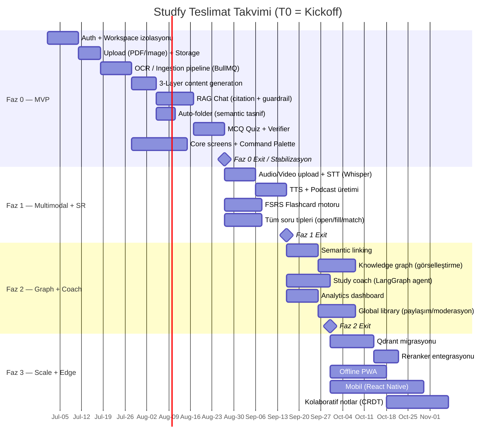
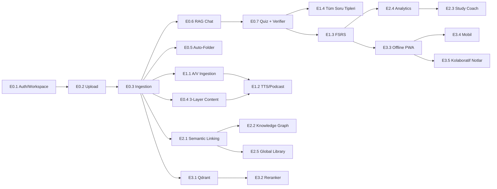

# Studfy — Ürün & Mühendislik Yol Haritası (ROADMAP)

> **AI-Native Öğrenme İşletim Sistemi** — fazlı teslimat planı, milestone'lar, exit kriterleri, riskler ve başarı metrikleri.

| | |
|---|---|
| **Doküman Sürümü** | 1.0 |
| **Durum** | Aktif |
| **Sahip** | Engineering Lead / CPO |
| **İlişkili Dokümanlar** | [PRD.md](./PRD.md), [TESTING.md](./TESTING.md), [OBSERVABILITY.md](./OBSERVABILITY.md) |
| **Son Güncelleme** | 2026-06-27 |

---

## 0. İçindekiler

1. [Yol Haritası Felsefesi](#1-yol-haritası-felsefesi)
2. [Faz Özeti](#2-faz-özeti)
3. [Mermaid Timeline (Gantt)](#3-mermaid-timeline-gantt)
4. [Now / Next / Later Board](#4-now--next--later-board)
5. [Faz 0 — MVP](#5-faz-0--mvp)
6. [Faz 1 — Multimodal + Spaced Repetition](#6-faz-1--multimodal--spaced-repetition)
7. [Faz 2 — Bilgi Grafiği + Çalışma Koçu + Global Kütüphane](#7-faz-2--bilgi-grafiği--çalışma-koçu--global-kütüphane)
8. [Faz 3 — Ölçek + Offline + Mobil + Kolaboratif](#8-faz-3--ölçek--offline--mobil--kolaboratif)
9. [Çapraz-Kesen İş Akışları (Cross-Cutting)](#9-çapraz-kesen-iş-akışları-cross-cutting)
10. [Bağımlılık Grafiği](#10-bağımlılık-grafiği)
11. [Risk Kaydı (Genel)](#11-risk-kaydı-genel)
12. [Başarı Metrikleri Özet Tablosu](#12-başarı-metrikleri-özet-tablosu)

---

## 1. Yol Haritası Felsefesi

- **Outcome > Output:** Her faz, sevk edilen feature sayısıyla değil, ölçülebilir öğrenci sonucuyla (activation, retention, RAG faithfulness) kapanır.
- **Vertical slices:** Her epic uçtan uca (web → bff → core-api → ai-service → veri katmanı) dikey dilim olarak teslim edilir; yatay katman bazlı "big bang" yoktur.
- **Quality gates per phase:** Bir faz, exit kriterleri + SLO'lar + test kapısı (bkz. TESTING.md) yeşil olmadan "done" sayılmaz.
- **Zero-hallucination is a P0 invariant:** RAG faithfulness ve citation precision, her fazda regresyona karşı korunan değişmezdir.
- **Reversible by default:** Faz 3'teki Qdrant migrasyonu gibi tek-yönlü kararlar dışında her şey feature flag arkasında ve geri alınabilir.

---

## 2. Faz Özeti

| Faz | Ad | Süre | Ana Tema | PRD Modülleri | Çıkış Hedefi (kısaca) |
|---|---|---|---|---|---|
| **Faz 0** | MVP | ~6–8 hafta | "Yükle → Bil → Sorgula → Test" temel döngüsü | 3.1, 3.2, 3.3, 3.4, 3.5 (temel RAG) | Tek kullanıcı uçtan uca öğrenme döngüsünü tamamlayabilir |
| **Faz 1** | Multimodal + SR | ~4–6 hafta | Ses/video, STT/TTS, podcast, FSRS flashcard | 3.1 (A/V), 3.3 (TTS), 3.4 (tüm soru tipleri), 3.6 (SR) | Yolda öğrenme + uzun-dönem hafıza döngüsü |
| **Faz 2** | Graph + Coach + Library | ~6 hafta | Semantik bağlama, knowledge graph, koç, analitik, global kütüphane | 3.2 (linking), 3.5 (global), 3.6 (coach/analytics) | Kişisel bilgi ağı + proaktif koçluk |
| **Faz 3** | Scale + Edge | Sürekli (rolling) | Qdrant, reranker, offline PWA, mobil, kolaboratif notlar | Mimari (4), 3.5 (reranker) | Ölçek, dayanıklılık, çoklu-cihaz |

---

## 3. Mermaid Timeline (Gantt)

---

## 4. Now / Next / Later Board

| 🟢 NOW (Faz 0, aktif sprint) | 🟡 NEXT (Faz 1) | 🔵 LATER (Faz 2–3) |
|---|---|---|
| Auth + per-user encrypted workspace | Audio/Video STT (Whisper) | Knowledge graph görselleştirme |
| PDF/Image upload + R2/S3 storage | TTS + podcast üretimi | Study coach agent (LangGraph) |
| OCR ingestion pipeline (BullMQ worker) | FSRS flashcard motoru | Analytics dashboard |
| 3-layer content (ELI5/Standart/Derin) | Açık uçlu / eşleştirme / boşluk doldurma soru tipleri | Global library + moderasyon |
| Zero-hallucination RAG chat + citation | | Qdrant migrasyonu + reranker |
| Auto-folder semantik tasnif | | Offline PWA |
| MCQ quiz + grounding verifier | | Mobil app (React Native) |
| Core screens + Command Palette (`⌘K`) | | Kolaboratif notlar (CRDT) |

> **WIP limiti:** NOW kolonunda eşzamanlı en fazla 3 epic. Bir epic "Done" (exit kriteri + test kapısı yeşil) olmadan yeni epic NEXT'ten çekilmez.

---

## 5. Faz 0 — MVP

**Hedef:** Tek bir öğrenci, hiçbir manuel kurulum olmadan bir PDF/görsel yükleyip; onu anlaşılır içeriğe çevirip, üzerine soru sorup, sıfır-halüsinasyon atıflı cevap alıp, otomatik klasörlenmiş içerikten doğrulanmış bir test çözebilsin.

### 5.1 Epics → Features → PRD Eşlemesi

| Epic | Features | PRD Modülü |
|---|---|---|
| **E0.1 Kimlik & Workspace** | Email/OAuth auth, oturum, per-user envelope encryption, veri izolasyonu (RLS) | §8 Güvenlik |
| **E0.2 Multimodal Upload (temel)** | PDF (text-layer) + görsel upload, R2/S3 presigned, virüs taraması, boyut/format guard | §3.1 |
| **E0.3 Ingestion Pipeline** | BullMQ queue, OCR (Vision + Tesseract fallback), chunking, embedding (pgvector) | §3.1, §3.5 |
| **E0.4 3-Katmanlı İçerik** | ELI5 / Standart / Derin anlatım üretimi, kaynak-bağlı | §3.3 |
| **E0.5 Akıllı Tasnif** | Auto-folder semantik kümeleme, etiketleme | §3.2 |
| **E0.6 RAG Chat** | Strict-RAG guardrail, zorunlu citation, streaming yanıt, "bilmiyorum" davranışı | §3.3, §3.5 |
| **E0.7 Quiz Motoru (MCQ)** | MCQ üretimi, **grounding verifier** (her şık kaynağa dayanmalı), puanlama | §3.4 |
| **E0.8 Core UX** | Dashboard, workspace tab'leri, Command Palette, doküman görüntüleyici | §7 |

### 5.2 Exit Kriterleri (Faz 0 "Done")

- [ ] Yeni kullanıcı kayıttan ilk RAG cevabına **< 5 dk** içinde ulaşabiliyor (TTFA — Time To First Answer).
- [ ] 50 sayfalık metin-katmanlı PDF ingestion **p95 < 90 sn**; 20 sayfalık taranmış PDF (OCR) **p95 < 180 sn**.
- [ ] RAG faithfulness eval skoru **≥ 0.90**, citation precision **≥ 0.95** (golden dataset üzerinde, bkz. TESTING.md).
- [ ] Quiz verifier: üretilen MCQ'ların **%100'ü** kaynak metne dayanmayan şık içermeden geçiyor (grounding gate).
- [ ] Workspace izolasyon testi: bir kullanıcının verisi başka kullanıcı bağlamında **hiçbir** sorguda sızdırılamıyor (negatif test paketi yeşil).
- [ ] Tüm P0/P1 e2e Playwright senaryoları yeşil; backend coverage **≥ %70**.
- [ ] SLO'lar (availability ≥ %99.0 staging, ingestion p95) Grafana'da dashboard'lu ve alert'li (bkz. OBSERVABILITY.md).

### 5.3 Bağımlılıklar

- E0.3 → E0.2 (upload olmadan ingestion yok).
- E0.4, E0.6, E0.7 → E0.3 (embedding/chunk hazır olmalı).
- E0.5 → E0.3 (semantik vektörler).
- E0.8, tüm epic'lerle paralel ilerler ama E0.6/E0.7 ekranları onlara bağımlı.

### 5.4 Riskler (Faz 0)

| Risk | Olasılık | Etki | Azaltım |
|---|---|---|---|
| OCR doğruluğu düşük el yazısında | Yüksek | Yüksek | Vision-LLM + Tesseract dual-pass, confidence skoru, kullanıcıya "düşük güven" uyarısı |
| RAG halüsinasyonu (citation uydurma) | Orta | Çok Yüksek | Strict retrieval guardrail + citation verifier + golden eval CI gate |
| LLM maliyet patlaması | Orta | Yüksek | LiteLLM ile model routing, cache, per-user budget guard (bkz. OBSERVABILITY) |
| Ingestion kuyruğu tıkanması | Orta | Orta | BullMQ concurrency tuning, dead-letter queue, queue depth alert |
| Embedding model değişiminde vektör uyumsuzluğu | Düşük | Yüksek | `embedding_version` kolonu + reindex job |

### 5.5 Başarı Metrikleri (Faz 0)

| Metrik | Hedef |
|---|---|
| Activation rate (kayıt → ilk başarılı RAG cevabı) | ≥ %60 |
| RAG faithfulness (golden) | ≥ 0.90 |
| Citation precision | ≥ 0.95 |
| Ingestion p95 (text PDF) | < 90 sn |
| Quiz grounding pass rate | %100 |
| Crash-free session | ≥ %99 |

---

## 6. Faz 1 — Multimodal + Spaced Repetition

**Hedef:** Ses/video girdileri yazıya ve özete dönüşür; içerik podcast olarak dinlenebilir; FSRS tabanlı flashcard'larla uzun-dönem hafıza döngüsü kurulur; tüm soru tipleri desteklenir.

### 6.1 Epics → Features → PRD Eşlemesi

| Epic | Features | PRD Modülü |
|---|---|---|
| **E1.1 A/V Ingestion** | Audio/video upload, Whisper STT, diarization, zaman damgalı transkript | §3.1 |
| **E1.2 TTS & Podcast** | TTS sesleri, çok-konuşmacılı podcast script üretimi, MP3 export | §3.3 |
| **E1.3 FSRS Flashcards** | FSRS scheduler, kart üretimi (kaynak-bağlı), günlük review akışı | §3.6 |
| **E1.4 Tüm Soru Tipleri** | Açık uçlu, boşluk doldurma, eşleştirme, doğru/yanlış, sıralama + verifier | §3.4 |

### 6.2 Exit Kriterleri

- [ ] 60 dk'lık ses kaydı STT **p95 < 8 dk** (async), kelime hata oranı (WER) Türkçe için **< %12**.
- [ ] Podcast üretimi tek tıkla, **p95 < 3 dk** (10 dk'lık özet için).
- [ ] FSRS scheduler doğruluğu: referans implementasyona karşı interval hesabı **bit-exact** (deterministik test).
- [ ] Yeni soru tiplerinin tamamı grounding verifier'dan geçiyor (Faz 0 invariant korunuyor).
- [ ] Flashcard review p95 latency (kart yükleme) **< 200 ms**.

### 6.3 Bağımlılıklar

- E1.1 → Faz 0 ingestion pipeline (E0.3).
- E1.2 → E1.1 (transkript) + E0.4 (özet katmanı).
- E1.3, E1.4 → E0.7 verifier altyapısı.

### 6.4 Riskler (Faz 1)

| Risk | Olasılık | Etki | Azaltım |
|---|---|---|---|
| Whisper Türkçe WER yüksek | Orta | Orta | `whisper-large-v3` + domain sözlüğü, kullanıcı düzeltme UI'ı |
| TTS doğallık/maliyet dengesi | Orta | Orta | Tiered TTS (ücretsiz vs premium ses), cache'lenmiş ses segmentleri |
| FSRS parametre regresyonu | Düşük | Yüksek | Deterministik seed + altın referans test seti (bkz. TESTING.md) |
| Uzun A/V dosyalarında storage maliyeti | Orta | Orta | Transcode + lifecycle policy, transkript sonrası ham medya soğuk depolama |

### 6.5 Başarı Metrikleri (Faz 1)

| Metrik | Hedef |
|---|---|
| A/V upload → transkript success rate | ≥ %97 |
| Türkçe WER | < %12 |
| Flashcard D7 retention (kart hatırlama) | ≥ %80 |
| Podcast feature adoption | ≥ %25 aktif kullanıcı |
| Soru tipi grounding pass rate | %100 |

---

## 7. Faz 2 — Bilgi Grafiği + Çalışma Koçu + Global Kütüphane

**Hedef:** İçerikler arası semantik bağlar otomatik kurulur, bilgi grafiği görselleştirilir; proaktif çalışma koçu (LangGraph agent) öğrenciyi yönlendirir; analitik dashboard ilerlemeyi gösterir; global kütüphane ile içerik paylaşımı açılır.

### 7.1 Epics → Features → PRD Eşlemesi

| Epic | Features | PRD Modülü |
|---|---|---|
| **E2.1 Semantic Linking** | Otomatik kavram bağları, "ilgili notlar", backlinks | §3.2 |
| **E2.2 Knowledge Graph** | Graf üretimi, interaktif görselleştirme, node merge | §3.2 |
| **E2.3 Study Coach** | LangGraph agent, zayıf konu tespiti, çalışma planı, nudge'lar | §3.6 |
| **E2.4 Analytics** | Öğrenme analitiği, retention eğrisi, konu mastery dashboard | §3.6 |
| **E2.5 Global Library** | İçerik paylaşımı, moderasyon, kopyala-workspace'e-ekle | §3.5 |

### 7.2 Exit Kriterleri

- [ ] Semantic linking precision@10 **≥ 0.85** (insan-etiketli değerlendirme setinde).
- [ ] Study coach önerileri faithfulness eval'den geçiyor; "yanlış konu önerme" oranı **< %5**.
- [ ] Global library moderasyon pipeline: PII/telif ihlali tespit recall **≥ %95** (otomatik + insan-in-the-loop).
- [ ] Knowledge graph 1000+ node'da **< 1.5 sn** render (client-side virtualization).
- [ ] Multi-tenant izolasyon: paylaşılan içerik sadece açık opt-in ile görünür (negatif testler yeşil).

### 7.3 Bağımlılıklar

- E2.1 → Faz 0 embedding altyapısı; E2.2 → E2.1.
- E2.3 → E2.4 (analitik sinyalleri koça besler) + Faz 1 FSRS verisi.
- E2.5 → §8 güvenlik + moderasyon servisi (yeni cross-cutting).

### 7.4 Riskler (Faz 2)

| Risk | Olasılık | Etki | Azaltım |
|---|---|---|---|
| Koç agent'in halüsinasyonlu/yanıltıcı tavsiyesi | Orta | Çok Yüksek | Tool-constrained agent + her tavsiye için kaynak + eval gate |
| Global library'de telif/PII sızıntısı | Orta | Çok Yüksek | Otomatik PII/telif tarama + insan moderasyon + DMCA akışı |
| Knowledge graph performans (büyük graf) | Orta | Orta | Server-side graf özetleme + client virtualization |
| Agent maliyeti (multi-step LangGraph) | Orta | Orta | Step budget, model tiering, sonuç cache |

### 7.5 Başarı Metrikleri (Faz 2)

| Metrik | Hedef |
|---|---|
| Semantic linking precision@10 | ≥ 0.85 |
| Coach-driven study session adoption | ≥ %30 |
| Yanlış konu önerme oranı | < %5 |
| Global library haftalık katkı | ≥ 500 öğe |
| Moderasyon recall (PII/telif) | ≥ %95 |
| W4 retention (4. hafta dönüş) | ≥ %40 |

---

## 8. Faz 3 — Ölçek + Offline + Mobil + Kolaboratif

**Hedef:** Vektör katmanını Qdrant'a taşıyıp reranker ile retrieval kalitesini artırmak; offline-first PWA, mobil uygulama ve kolaboratif notlarla çoklu-cihaz/çoklu-kullanıcı deneyimini açmak.

### 8.1 Epics → Features → PRD Eşlemesi

| Epic | Features | PRD Modülü |
|---|---|---|
| **E3.1 Qdrant Migrasyonu** | pgvector → Qdrant, çift-yazma (dual-write), shadow read, cutover | §4 Mimari |
| **E3.2 Reranker** | Cross-encoder reranker, retrieval kalite artışı | §3.5 |
| **E3.3 Offline PWA** | Service worker, IndexedDB cache, offline review, sync | §4 |
| **E3.4 Mobil** | React Native app, push, native upload | §4 |
| **E3.5 Kolaboratif Notlar** | CRDT (Yjs), realtime presence, paylaşımlı workspace | §3.2 |

### 8.2 Exit Kriterleri

- [ ] Qdrant cutover: dual-write/shadow-read sırasında pgvector vs Qdrant retrieval **recall paritesi ≥ %99**; rollback planı test edildi.
- [ ] Reranker: nDCG@10 iyileşmesi baseline'a göre **≥ +%8**; ek latency **p95 < 150 ms**.
- [ ] Offline PWA: flashcard review ve okuma offline çalışıyor; reconnect'te conflict-free sync (CRDT).
- [ ] Mobil: temel akış (upload, chat, review) e2e (Detox) yeşil; crash-free **≥ %99.5**.
- [ ] Kolaboratif notlarda concurrent edit'te veri kaybı **sıfır** (CRDT property test).

### 8.3 Bağımlılıklar

- E3.2 → E3.1 (Qdrant hosted retrieval).
- E3.3, E3.4 → stable API kontratları (bkz. contract testing, TESTING.md).
- E3.5 → E3.3 sync altyapısı.

### 8.4 Riskler (Faz 3)

| Risk | Olasılık | Etki | Azaltım |
|---|---|---|---|
| Qdrant migrasyonunda veri/recall kaybı | Orta | Çok Yüksek | Dual-write + shadow-read + recall parity gate + tek-tık rollback |
| Offline sync conflict | Yüksek | Orta | CRDT (Yjs), property-based test, last-writer-wins yerine merge |
| Mobil store onay gecikmeleri | Orta | Düşük | Erken TestFlight/internal track, OTA update (CodePush) |
| Reranker latency bütçesi aşımı | Orta | Orta | Top-k küçültme, batch rerank, GPU/CPU profilleme |

### 8.5 Başarı Metrikleri (Faz 3)

| Metrik | Hedef |
|---|---|
| Qdrant recall parity (vs pgvector) | ≥ %99 |
| Reranker nDCG@10 iyileşmesi | ≥ +%8 |
| Offline session başarı oranı | ≥ %95 |
| Mobil crash-free | ≥ %99.5 |
| Kolaboratif edit veri kaybı | 0 |

---

## 9. Çapraz-Kesen İş Akışları (Cross-Cutting)

Bu akışlar tek faza ait değildir; her fazda bakım/iyileştirme alır:

| Akış | Açıklama | İlk teslim |
|---|---|---|
| **Security & Privacy** | Envelope encryption, RLS, audit log, GDPR/KVKK export-delete | Faz 0 |
| **Observability** | OTel, Grafana/Loki, Langfuse, SLO/alert (bkz. OBSERVABILITY.md) | Faz 0 |
| **Cost Governance** | Per-user AI budget, LiteLLM routing, token/cost telemetri | Faz 0 |
| **CI/CD & Quality Gates** | Test piramidi, eval gate, contract test (bkz. TESTING.md) | Faz 0 |
| **i18n / Accessibility** | TR-öncelikli, WCAG AA, klavye-öncelikli | Faz 0+ |
| **Design System** | Linear/Notion sadeliği, component lib | Faz 0+ |

---

## 10. Bağımlılık Grafiği

---

## 11. Risk Kaydı (Genel)

| ID | Risk | Faz | Sahip | Durum | Azaltım Özeti |
|---|---|---|---|---|---|
| R-01 | Zero-hallucination invariant regresyonu | Tümü | AI Lead | Aktif | Golden eval CI gate, citation verifier |
| R-02 | LLM maliyet sürdürülemezliği (ücretsiz model) | Tümü | Eng Lead | Aktif | Routing, cache, per-user budget, açık-kaynak model fallback |
| R-03 | Veri izolasyon/güvenlik ihlali | Tümü | Security | Aktif | RLS, envelope encryption, negatif test paketi, pentest |
| R-04 | Qdrant migrasyon riski | Faz 3 | Platform | İzlemede | Dual-write/shadow-read, rollback |
| R-05 | OCR/STT Türkçe kalite | Faz 0/1 | AI Lead | Aktif | Dual-pass, kullanıcı düzeltme, domain sözlük |
| R-06 | Global library yasal/telif | Faz 2 | Legal/Eng | İzlemede | Moderasyon + DMCA |

---

## 12. Başarı Metrikleri Özet Tablosu

| Metrik (kuzey yıldızı türevleri) | Faz 0 | Faz 1 | Faz 2 | Faz 3 |
|---|---|---|---|---|
| Activation rate | ≥ %60 | ≥ %65 | ≥ %70 | ≥ %72 |
| RAG faithfulness (golden) | ≥ 0.90 | ≥ 0.92 | ≥ 0.93 | ≥ 0.94 |
| Citation precision | ≥ 0.95 | ≥ 0.95 | ≥ 0.96 | ≥ 0.97 |
| Ingestion p95 (text PDF) | < 90 sn | < 80 sn | < 75 sn | < 60 sn |
| W4 retention | — | ≥ %35 | ≥ %40 | ≥ %45 |
| Availability (prod) | ≥ %99.0 | ≥ %99.5 | ≥ %99.5 | ≥ %99.9 |
| Per-user aylık AI maliyet | bütçe içi | ↓ %10 | ↓ %15 | ↓ %20 |

> Metrik tanımları ve ölçüm yöntemleri için bkz. [OBSERVABILITY.md](./OBSERVABILITY.md) §SLO/SLI ve [PRD.md](./PRD.md) §11 Kabul Kriterleri.
