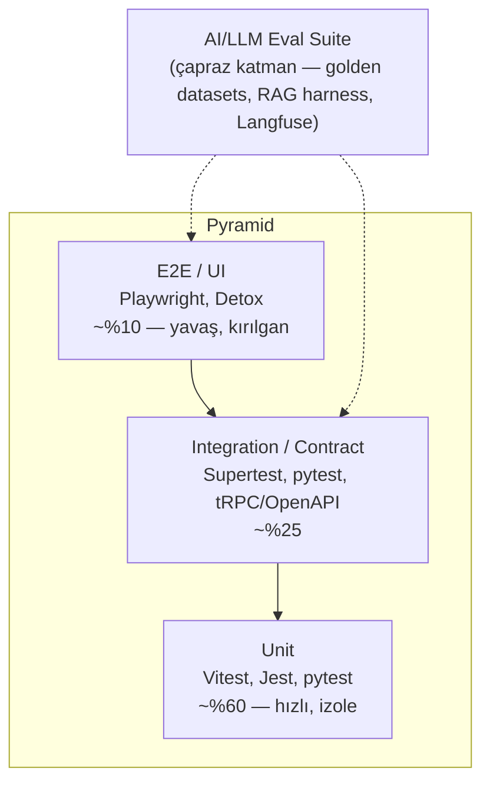
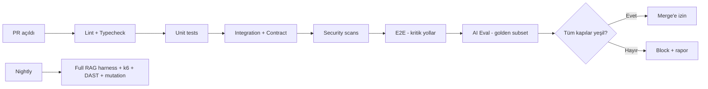

# Studfy — Test & QA Stratejisi (TESTING)

> Sıfır-halüsinasyon bir AI-native öğrenme OS'i için kapsamlı kalite güvence stratejisi: test piramidi, AI/LLM-özel testler, RAG eval harness, yük/güvenlik testleri ve CI kapıları.

| | |
|---|---|
| **Doküman Sürümü** | 1.0 |
| **Durum** | Aktif |
| **Sahip** | QA Lead / Engineering Lead |
| **İlişkili** | [ROADMAP.md](./ROADMAP.md), [OBSERVABILITY.md](./OBSERVABILITY.md), [PRD.md](./PRD.md) |

---

## 0. İçindekiler

1. [Test Felsefesi & İlkeler](#1-test-felsefesi--i̇lkeler)
2. [Test Piramidi](#2-test-piramidi)
3. [Katman Katman Araçlar](#3-katman-katman-araçlar)
4. [Contract Testing (tRPC / OpenAPI)](#4-contract-testing-trpc--openapi)
5. [AI / LLM-Özel Testler](#5-ai--llm-özel-testler)
6. [RAG Eval Harness](#6-rag-eval-harness)
7. [Quiz Verifier Grounding — Somut Örnek](#7-quiz-verifier-grounding--somut-örnek-test)
8. [Yük & Performans Testi (k6)](#8-yük--performans-testi-k6)
9. [Güvenlik Testi (CI)](#9-güvenlik-testi-ci)
10. [Test Verisi & Fixtures](#10-test-verisi--fixtures)
11. [Coverage Hedefleri](#11-coverage-hedefleri)
12. [Flaky-Test Politikası](#12-flaky-test-politikası)
13. [CI Kapıları (Gates)](#13-ci-kapıları-gates)

---

## 1. Test Felsefesi & İlkeler

- **Test pyramid, not ice-cream cone:** Çoğunluk hızlı/ucuz unit; az sayıda yavaş/pahalı e2e.
- **Determinism first:** AI testlerinde rastgelelik kontrol altında — sabit seed, `temperature=0`, sabitlenmiş model sürümü, kaydedilmiş (recorded) LLM yanıtları.
- **Invariants are gates:** Zero-hallucination (faithfulness, citation precision) ve veri izolasyonu, geçilemez CI kapılarıdır.
- **Eval-as-test:** LLM çıktıları "doğru/yanlış" değil "skorlu"; eşik altına düşen PR bloklanır.
- **Shift-left security:** SAST/SCA/secret-scan her PR'da; izolasyon negatif testleri zorunlu.

---

## 2. Test Piramidi



| Katman | Oran | Hız | Kapsam |
|---|---|---|---|
| Unit | ~%60 | ms | Saf fonksiyonlar, scheduler (FSRS), parser'lar, guard'lar, reducer'lar |
| Integration | ~%25 | sn | API endpoint'leri, DB (pgvector), queue (BullMQ), storage (R2) |
| Contract | (integration içinde) | sn | tRPC router ↔ client, FastAPI OpenAPI ↔ tüketiciler |
| E2E | ~%10 | dk | Kritik kullanıcı yolculukları (upload→chat→quiz) |
| AI Eval | çapraz | dk | Faithfulness, citation, grounding, regression (ayrı pipeline) |

---

## 3. Katman Katman Araçlar

| Servis / Katman | Stack | Unit | Integration | E2E |
|---|---|---|---|---|
| **web** (Next.js 15) | TS/React | Vitest + Testing Library | Vitest (MSW ile mock API) | Playwright |
| **bff** (NestJS) | TS | Jest | Jest + Supertest (test DB) | Playwright (üzerinden) |
| **core-api** (NestJS) | TS | Jest | Jest + Supertest + Testcontainers (Postgres/Redis) | — |
| **ai-service** (FastAPI/LangGraph/LlamaIndex) | Python | pytest | pytest + httpx + Testcontainers (Qdrant/pg) | — |
| **workers** (BullMQ) | TS | Jest | Jest + ioredis-mock / real Redis | — |
| **mobil** (Faz 3, RN) | TS | Jest | — | Detox |

**Ortak prensipler:**
- Integration testleri **Testcontainers** ile gerçek Postgres+pgvector, Redis, (Faz 3) Qdrant ayağa kaldırır — mock değil.
- web unit testlerinde ağ çağrıları **MSW** (Mock Service Worker) ile durdurulur.
- LLM çağrıları test ortamında **fake/stub provider** (LiteLLM mock) veya kaydedilmiş yanıtlarla; canlı LLM yalnızca nightly eval pipeline'da.

---

## 4. Contract Testing (tRPC / OpenAPI)

İki sınır kritik: (1) web ↔ bff (tRPC), (2) bff/core-api ↔ ai-service (FastAPI OpenAPI).

### 4.1 tRPC (web ↔ bff)
- Router tipleri tek kaynaktan paylaşılır (`packages/contracts`); derleme zamanı tip-güvenliği ilk savunma.
- Runtime kontratı için **zod** şemaları; her procedure input/output zod ile doğrulanır ve snapshot test edilir.

### 4.2 OpenAPI (ai-service)
- FastAPI otomatik OpenAPI üretir; CI'da spec **diff** alınır — kırıcı değişiklik (breaking change) tespit edilirse PR bloklanır (örn. `oasdiff` ile).
- Tüketici tarafında generated client (`openapi-typescript`) ile tip uyumu derlemede zorlanır.

### 4.3 Consumer-Driven Contracts (Pact, opsiyonel Faz 2+)
- bff (consumer) ↔ ai-service (provider) için Pact broker; provider verification CI'da.

```yaml
# .github/workflows/contract.yml (özet)
- name: OpenAPI breaking-change check
  run: |
    oasdiff breaking \
      services/ai-service/openapi.baseline.json \
      services/ai-service/openapi.json \
      --fail-on ERR
```

---

## 5. AI / LLM-Özel Testler

LLM çıktıları non-deterministik olduğu için klasik assert yetmez. Üç katman uygularız:

### 5.1 Determinizm Kontrolleri
- `temperature=0`, sabit `seed`, **pinned model** (`claude-…` sürüm sabit, LiteLLM alias üzerinden).
- Prompt'lar versiyonlu (`prompts/<name>.vN.md`), hash'i test'e gömülü — prompt değişimi bilinçli olmadan regresyon yapamaz.
- LLM yanıtları **VCR/cassette** mantığıyla kaydedilir; deterministik unit/integration testlerinde replay edilir.

### 5.2 Golden Datasets
- `tests/golden/` altında insan-onaylı (soru, bağlam, beklenen cevap, beklenen citation) örnekleri.
- Her golden örnek için skorlanır: **faithfulness**, **citation precision/recall**, **answer relevancy**, **no-hallucination** (uydurma kaynak yok).
- Eşik altı PR'ı bloklar (bkz. §13 gates).

### 5.3 Faithfulness & Citation Precision Eval
- **Faithfulness:** Cevaptaki her iddia, getirilen (retrieved) bağlamdan türetilebilmeli. LLM-as-judge + kural tabanlı doğrulama hibrit.
- **Citation precision:** Atfedilen kaynak gerçekten o iddiayı destekliyor mu? (precision) ve gereken atıflar var mı? (recall).
- Judge modeli de **pinned**; judge'ın kendisi meta-golden set ile kalibre edilir (judge drift kontrolü).

### 5.4 Prompt Regression
- Nightly pipeline tüm golden set'i çalıştırır; skor trend'i Langfuse'a yazılır.
- Bir prompt/model değişiminde skor düşüşü > eşik → otomatik issue + release block.

### 5.5 Langfuse Entegrasyonu
- Tüm eval koşuları Langfuse'a trace + score olarak gider; PR yorumunda skor delta tablosu otomatik post edilir.
- Üretimdeki gerçek trafikten örneklenen (sampled) trace'ler periyodik olarak offline eval'e beslenir (production-grounded regression).

---

## 6. RAG Eval Harness

Bağımsız çalışan, hem CI hem nightly tetiklenen Python harness (pytest + RAGAS/DeepEval benzeri metrikler + özel kurallar).

```python
# tests/rag/eval_harness.py (özet)
import pytest
from studfy_eval import run_pipeline, score

GOLDEN = load_jsonl("tests/golden/rag_qa.jsonl")

THRESHOLDS = {
    "faithfulness":       0.90,
    "citation_precision": 0.95,
    "answer_relevancy":   0.85,
    "context_recall":     0.80,
}

@pytest.mark.eval
@pytest.mark.parametrize("case", GOLDEN, ids=lambda c: c["id"])
def test_rag_quality(case):
    out = run_pipeline(
        query=case["query"],
        workspace=case["workspace_fixture"],
        model="claude-pinned",     # sabitlenmiş sürüm
        temperature=0, seed=42,
    )
    s = score(out, reference=case)
    # Sıfır-halüsinasyon invariant: uydurma citation yasak
    assert out.has_no_fabricated_citations(), f"Fabricated citation: {out.citations}"
    for metric, threshold in THRESHOLDS.items():
        assert s[metric] >= threshold, f"{case['id']} {metric}={s[metric]:.3f} < {threshold}"
```

**Harness çıktıları:**
- Toplu skor raporu (JSON + markdown tablo), Langfuse'a dataset run.
- Per-case fail listesi + getirilen bağlam dump'ı (debug için).
- "Aggregate gate": ortalama faithfulness < 0.90 veya herhangi bir case'de fabricated citation → **fail**.

| Metrik | Tanım | Faz 0 eşiği |
|---|---|---|
| Faithfulness | İddiaların bağlamdan türetilebilirliği | ≥ 0.90 |
| Citation precision | Doğru atıf oranı | ≥ 0.95 |
| Citation recall | Gerekli atıfların kapsanması | ≥ 0.80 |
| Answer relevancy | Cevabın soruyla ilgisi | ≥ 0.85 |
| Context recall | Doğru bağlamın getirilmesi | ≥ 0.80 |
| Refusal correctness | Bağlam yoksa "bilmiyorum" deme oranı | ≥ 0.95 |

---

## 7. Quiz Verifier Grounding — Somut Örnek Test

Quiz motorunun değişmezi: **üretilen her MCQ ve her şık, kaynak metne dayanmalı**; doğru cevap kaynakta açıkça desteklenmeli, çeldiriciler kaynağa aykırı/uydurma olmamalı (ya da bilinçli yanlış ama kaynak-tutarlı).

```typescript
// services/core-api/src/quiz/verifier.spec.ts  (Vitest/Jest)
import { describe, it, expect, beforeAll } from "vitest";
import { QuizVerifier } from "./quiz.verifier";
import { loadFixtureChunks } from "../../../test/fixtures/chunks";

describe("QuizVerifier — grounding gate", () => {
  let verifier: QuizVerifier;
  let sourceChunks: Chunk[];

  beforeAll(async () => {
    // Deterministik fixture: bilinen tek bir kaynak parçası
    sourceChunks = await loadFixtureChunks("photosynthesis_tr.json");
    verifier = new QuizVerifier({ model: "claude-pinned", temperature: 0, seed: 7 });
  });

  it("doğru cevabı kaynağa dayanan MCQ'yu KABUL eder", async () => {
    const mcq = {
      stem: "Fotosentez hangi organelde gerçekleşir?",
      options: ["Kloroplast", "Mitokondri", "Ribozom", "Golgi"],
      answerIndex: 0,
      sourceSpan: { chunkId: sourceChunks[0].id, start: 12, end: 64 },
    };
    const result = await verifier.verify(mcq, sourceChunks);
    expect(result.grounded).toBe(true);
    expect(result.answerSupported).toBe(true);
    expect(result.fabricatedOptions).toHaveLength(0);
  });

  it("kaynakta DESTEKLENMEYEN doğru cevabı REDDEDER", async () => {
    const mcq = {
      stem: "Fotosentez hangi organelde gerçekleşir?",
      options: ["Lizozom", "Mitokondri", "Ribozom", "Golgi"], // doğru cevap kaynakta yok
      answerIndex: 0,
      sourceSpan: { chunkId: sourceChunks[0].id, start: 12, end: 64 },
    };
    const result = await verifier.verify(mcq, sourceChunks);
    expect(result.grounded).toBe(false);
    expect(result.reason).toMatch(/answer not supported by source/i);
  });

  it("UYDURMA çeldirici (kaynağa aykırı yanlış olgu) içeren MCQ'yu işaretler", async () => {
    const mcq = {
      stem: "Fotosentezde üretilen gaz nedir?",
      options: ["Oksijen", "Karbondioksit", "Azot kloroplastta yakılır", "Helyum"],
      answerIndex: 0,
      sourceSpan: { chunkId: sourceChunks[0].id, start: 80, end: 130 },
    };
    const result = await verifier.verify(mcq, sourceChunks);
    expect(result.grounded).toBe(true);          // doğru cevap destekli
    expect(result.fabricatedOptions).toContain(2); // "Azot kloroplastta yakılır" uydurma
    expect(result.gatePassed).toBe(false);         // gate: uydurma çeldirici varsa geç
  });
});
```

> **Gate semantiği:** `gatePassed = grounded && answerSupported && fabricatedOptions.length === 0`. Quiz üretim pipeline'ı, gate'i geçemeyen soruyu kullanıcıya **asla** göstermez; otomatik yeniden üretir veya düşürür (drop). CI'da, golden quiz set'inde grounding pass rate **%100** beklenir (bkz. ROADMAP Faz 0 exit).

---

## 8. Yük & Performans Testi (k6)

Hedef SLO'lar OBSERVABILITY.md ile hizalı (ingestion p95, RAG latency p95).

```javascript
// tests/load/rag_chat.k6.js
import http from "k6/http";
import { check, sleep } from "k6";
import { Trend } from "k6/metrics";

const ragLatency = new Trend("rag_latency_ms", true);

export const options = {
  scenarios: {
    steady: { executor: "constant-vus", vus: 50, duration: "5m" },
    spike:  { executor: "ramping-vus", startVUs: 0,
      stages: [{ duration: "30s", target: 200 }, { duration: "1m", target: 200 }, { duration: "30s", target: 0 }] },
  },
  thresholds: {
    "rag_latency_ms": ["p(95)<3000"],          // RAG p95 < 3s
    "http_req_failed": ["rate<0.01"],          // hata < %1
  },
};

export default function () {
  const res = http.post(`${__ENV.BASE_URL}/api/chat`,
    JSON.stringify({ workspaceId: __ENV.WS, query: "Bu konunun özetini ver" }),
    { headers: { "Content-Type": "application/json", Authorization: `Bearer ${__ENV.TOKEN}` } });
  ragLatency.add(res.timings.duration);
  check(res, { "200": (r) => r.status === 200, "has citation": (r) => r.json("citations").length > 0 });
  sleep(1);
}
```

| Senaryo | Yük | Eşik |
|---|---|---|
| RAG chat steady | 50 VU / 5dk | p95 < 3s, hata < %1 |
| RAG chat spike | 200 VU burst | p95 < 5s, hata < %2 |
| Ingestion throughput | 20 eşzamanlı upload | queue drain p95 < 90s (text PDF) |
| Vector search | 100 rps | p95 < 150ms |

Nightly + release-candidate'ta çalışır; sonuçlar Grafana'ya pushlanır.

---

## 9. Güvenlik Testi (CI)

| Tür | Araç | Kapı |
|---|---|---|
| SAST | Semgrep / CodeQL | High/Critical → block |
| Dependency (SCA) | `npm audit`, `pip-audit`, Dependabot | Critical CVE → block |
| Secret scanning | Gitleaks / trufflehog | Bulgu → block |
| Container scan | Trivy (image + IaC) | High/Critical → block |
| DAST (nightly) | OWASP ZAP baseline | Yeni High → issue |
| **Tenant izolasyon** | Özel negatif test paketi (bkz. §10) | Sızıntı → **hard block** |
| Authz testleri | Supertest/pytest rol matrisleri | Yetki aşımı → block |

**Tenant izolasyon negatif testleri (örnek):**
```typescript
it("kullanıcı A, kullanıcı B'nin dokümanını RAG ile çekemez", async () => {
  const res = await asUser(userA).post("/api/chat")
    .send({ workspaceId: userB.workspaceId, query: "..." });
  expect(res.status).toBe(403);
});
it("vektör arama workspace filtresi olmadan sonuç dönmez", async () => {
  const hits = await vectorSearch({ query: embeddingOfBData, /* workspace yok */ });
  expect(hits).toHaveLength(0); // RLS / pre-filter zorunlu
});
```

---

## 10. Test Verisi & Fixtures

| Tür | Yaklaşım |
|---|---|
| **DB fixtures** | Factory pattern (`@faker-js`, `factory_boy`); her test izole transaction + rollback |
| **Storage** | MinIO (R2/S3 uyumlu) Testcontainer; örnek PDF/görsel/ses `tests/assets/` |
| **Vector** | Önceden hesaplanmış embedding'ler (`embedding_version` pinned) — model çağrısı yok |
| **LLM cassettes** | Kaydedilmiş request/response; `RECORD=1` ile yenilenir, aksi halde replay |
| **Golden datasets** | `tests/golden/*.jsonl`, code review zorunlu, PII-temiz |
| **Seed kullanıcılar** | İzole `tenant-test-*`; prod verisi asla kullanılmaz |

İlkeler: her test kendi verisini kurar/yıkar (no shared mutable state); tarih/saat ve `seed` sabitlenir; ham telifli/PII içerik repo'ya girmez (sentetik veri).

---

## 11. Coverage Hedefleri

| Servis | Line | Branch | Kritik yol (mutation/branch) |
|---|---|---|---|
| core-api | ≥ %80 | ≥ %75 | Quiz verifier, RAG guardrail, auth/RLS: ≥ %95 |
| bff | ≥ %75 | ≥ %70 | — |
| ai-service | ≥ %80 | ≥ %75 | Retrieval/citation: ≥ %90 |
| workers | ≥ %75 | ≥ %70 | Ingestion idempotency: ≥ %90 |
| web | ≥ %70 | ≥ %65 | — |

- Coverage düşüşü (PR base'e göre) **> %1** ise uyarı, **> %3** ise block.
- Salt sayı değil: kritik invariant yollarında **mutation testing** (Stryker / mutmut) periyodik.

---

## 12. Flaky-Test Politikası

1. **Tespit:** CI, retry ile yeşile dönen testi "flaky" olarak işaretler (`--retries=2` yalnızca raporlama amaçlı, gate değil).
2. **Quarantine:** Flaky test 24 saat içinde `@flaky` tag'iyle karantinaya alınır → gate'ten çıkar ama nightly'de izlenir.
3. **SLA:** Karantinadaki test **5 iş günü** içinde düzeltilir veya silinir. Süre aşımında owner'a eskalasyon.
4. **Kök neden:** Çoğu flake kaynağı: gerçek zaman/`sleep`, sıralama varsayımı, paylaşılan state, ağ. Çözüm: fake timer, deterministik seed, izolasyon.
5. **Flake bütçesi:** Suite flake oranı **< %0.5**; aşılırsa yeni feature merge'leri yavaşlatılır (quality freeze).

---

## 13. CI Kapıları (Gates)



| Kapı | PR'da | Nightly'de | Block koşulu |
|---|---|---|---|
| Lint + Typecheck | ✅ | ✅ | Herhangi hata |
| Unit | ✅ | ✅ | Fail veya coverage düşüşü > %3 |
| Integration + Contract | ✅ | ✅ | Fail / OpenAPI breaking change |
| Security (SAST/SCA/secret) | ✅ | ✅ | High/Critical |
| Tenant izolasyon | ✅ | ✅ | Herhangi sızıntı (hard) |
| E2E (kritik yollar) | ✅ | ✅ (tam suite) | P0/P1 fail |
| AI Eval (golden subset) | ✅ | ✅ (full) | Faithfulness < 0.90 / citation < 0.95 / fabricated citation |
| Quiz grounding | ✅ | ✅ | Grounding pass rate < %100 |
| k6 yük | — | ✅ | SLO eşiği aşımı |
| Mutation (kritik yollar) | — | haftalık | Mutation score < eşik |

> **Altın kural:** Zero-hallucination eval kapısı ve tenant izolasyon kapısı **override edilemez** — release manager bile bypass edemez.
